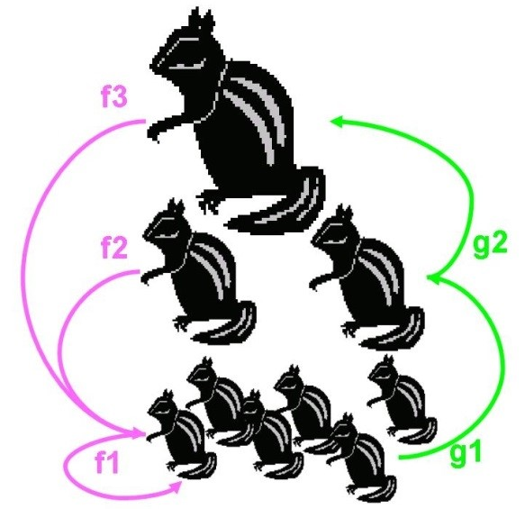

```{r setup, include=FALSE}
knitr::opts_chunk$set(
  echo = TRUE,
  fig.width=6, fig.height=5
)
```

\vspace{50pt}


# R Basics

## Staring an R session

### Using scripts
A "Script" is a text window where coding can be written, manipulated and introduced to the Workspace (with ctrl Enter). These can be saved to the Directory folder as well. This will save time in the future when we have several lines of code to introduce. Within the script, we write all necessary commands. To make simulation experiments, we execute the script to run the model.

Open a new script (">>File>>New script …") and copy the following lines of code (in blue below) into the script window:

```{r, background=grey}
x=5 
y=3
x*y
```

\newpage
# Matrix models
## Age-structured matrix model
For the prediction of population growth, it is sometimes necessary to track the individuals within certain age or size classes. This is useful if demographic parameters such as fecundity or survivorship change during individual's life and if this affects population’s structure.

Assume a population which can be structured into three different age classes x = 1, 2, 3. Then, the fecundity of the individuals could be labelled as fx, and the probability that the individuals survive their age class px. Let, furthermore, nx,t denote the number of individuals within each age class at time t. We can now calculate the number of individuals in the next time step as:

$$
\begin{aligned}
  n_{t+1,1} = f_1 \times n_{t,1} + f_2 \times n_{t,2} + f_3 \times n_{t,3} \\
  n_{t+1,2}=g_1 \times n_{t,1} \\
  n_{t+1,3}=g_2 \times n_{t,2}
\end{aligned}
$$



This model makes two assumptions:

1. All age classes have the same time increment. 
2. There are no survivors after the last age class. 

The defined age classes must be, therefore, large enough to capture the entire life span of the individuals. 

To condense the form of these equations we can use matrix arithmetic:


$$
\mathrm{L} = 
\begin{bmatrix}
  f_1 & f_2 & f_3 \\
  g_1 & 0 & 0 \\
  0 & g_2 & 0
\end{bmatrix}
$$
Includes all fecundities $f_x$ in the first row and the transition rates $g_x$ between the age classes in the "sub-diagonal". Since P.H. Leslie introduced this notation into the studies of population growth, it is called *LESLIE*-matrix.

$$
  \mathrm{N}_t = \begin{bmatrix}
    n_{t,1} & n_{t,2} & n_{t,3}   
  \end{bmatrix}
$$

Each element of this vector marks the individuals within an age class at time t.

**TASK:** Use the following information to create an age-structured population model for the squirrel population. Assume a population that can be described by the following matrix: 

$$
\mathrm{L} = 
\begin{bmatrix}
  0.5 & 1 & 0.75 \\
  0.6666 & 0 & 0 \\
  0 & 0.3333 & 0
\end{bmatrix}
$$

```{r, echo = FALSE, results = "hide"}
L <- matrix(c(
  0.5, 0.6666, 0, 
  1.0, 0, 0.3333, 
  0.75, 0, 0
  ), 
  nrow=3, ncol=3
)
L
```


\newpage
## Iterative projection of a matrix model
Now we will learn to iterated the population over time. In order to calculate the number of individuals in each age class at time t+1, the vector of population numbers by age is multiplied by the matrix, $\mathrm{N}_{t+1} = \mathrm{L} \times \mathrm{N}_t$. In *R* we use the notation `%*%` to denote a matrix multiplication. 

```{r, results = "hide"}
# To multiply matrices, we use the %*% operator
N = c(2, 0, 0) # pop at t
L %*% N # pop at t+1
```


In the following example, the initial population (`N0`) is initialized by two individuals in the first age class:

```{r}
time <- 1:10
N0 <- c(2,0,0)

POP <- matrix(NaN, nrow=length(time), ncol=length(N0))
POP[1,] <- N0
for (i in 2:length(time)){
	POP[i,] <- L %*% POP[i-1,]
}

plot(time,POP[,1], type="l", ylim=range(POP), ylab="numbers", xlab="time")
for (i in 2:length(POP[1,])){
	lines(seq(time),POP[,i],col=i)
}

legend("topleft",
c(paste("class",(1:length(N0)))),
lwd=1,
col=c(1:length(N0)))
```


## Direct evaluation of a matrix model
Using a matrix for calculating age/class dynamics has an advantage in terms of calculation speed. Furthermore, for a square matrix, the matrix governs the behaviour of solutions to the corresponding system of linear equations. An *Eigen decomposition* of this matrix can reveal several aspects of the population (at equilibrium). The following sections outline how to extract the following information from a matrix model: 

1. Rate of population growth
2. Stable age/stage distribution
3. Reproductive value
4. Parameter sensitivity and elasticity

### Population growth rate
**Eigenvalues** provide insight into the geometry of the associated linear transformation. Specifically, the dominant, or largest, eigenvalue is related to the population growth rate at equilibrium. In practical terms, the dominant (1st) eigenvalue ($\lambda$) of the matrix should give roughly the same value as the rate of change for the whole population as it reaches equilibrium. In the above iteration of the population, the Leslie matrix, $\mathrm{L}$, acts as a coefficient of change for all classes simultaneously, $\mathrm{N}_{t+1}=\mathrm{L} \times \mathrm{N}_t$. The value of $\lambda$ simplifies this rate of change to a single value, such as one would use for a simulating a population without classes: $n_{t+1}=\lambda \times n_t$.
In order to derive $\lambda$, we first conduct an Eigen decomposition; The function returns a list containing eigenvalues (`x$values`) and eigenvectors (`x$vectors`). The value of $\lambda$ may not seem obvious given that it is a complex number containing a "real" and "imaginary" part. We are only concerned with the real part, which you can return with the `Re` function:

```{r}
x <- eigen(L)
x
Re(x$values)[1] # dominant (1st) eigenvalue
```


The dominant eigenvalue is more like a percent increase [\%] in its interpretation, such that a value of 1.1 would mean that a population is increasing at 10% per time unit ((1.1 – 1.0) * 100\% = 10\%).  A value <1.0 means that the population is decreasing (*e.g.* ((0.9 - 1.0) * 100\% = -10\%). 

**Task:** Compare $\lambda$ to that of the rate of population change between the last two iterations (*i.e.* t=9 vs. t=10). As a first step, `rowSums(POP)` will give you the sum population size by summing all age classes at each time step (row).

```{r, echo=FALSE, eval=FALSE, results='hide'}
POPsum <- rowSums(POP)
POPr <- POPsum[-1] / POPsum[-length(POPsum)]
plot(POPr, t="o", ylab="Rel. change in POP", xlab = "t")
abline(h=Re(x$values)[1], col=8, lty=3)
legend("topright", 
  legend = paste("lambda =", round(Re(x$values)[1],2)),
  lty = 3, col = 8
)
```


### Stable population distribution
The stable population distribution is specified by the 1st **eigenvector**. The proportion of each element of the vector sum equals the corresponding class proportions when the population is at equilibrium:

```{r}
Re(x$vectors[,1]/sum(x$vectors[,1]))
```


### Reproductive value
The "reproductive value" is the value of a given age-class or stage as a seed for population growth (newborn or first age class reproductive value = 1.0 by definition). It represents the expected number of offspring per individual over the remaining lifetime. It is calculated from the **left eigenvector**, which can be obtained by using the `eigen` function on the transpose (`t()`) of the matrix:

```{r}
x <- eigen(t(L))
Re(1/x$vectors[1,1] * x$vectors[,1])
```


### Parameter sensitivity and elasticity
Matrix models can easily tell us about the transitions in the life cycle to which the population growth rate ($\lambda$) is **sensitive** or **elastic** to changes. This can be important information for conservation efforts; For example, if the trajectory of the population growth rate is sensitive to small changes in a particular parameter, then we will need to make very accurate measurements of its value. On the other hand, insensitive parameters suggest places where one may not want not invest too much conservation resources. 

**Sensitivity** ($s$) is the effect of an *absolute change* in a vital rate on $\lambda$. For example, if we change first-year survival by 0.01, how much will that affect the population growth rate? *e.g.*,

$$
s_{ij}=\frac{\delta \lambda}{\delta p_{ij}}
$$

where $\delta \lambda = \lambda_{new}-\lambda_{old}$ and $\delta p_{ij}=p_{ij_{new}} - p_{ij_{old}}$.

\vspace{20pt}

**Elasticity** ($e$) is the effect of a proportional change on $\lambda$. For example, if we change first-year survival by 1\%, how much will that affect population growth? *e.g.*,

$$
e_{ij} = 
  \Big(\frac{\delta \lambda}{\delta p_{ij}}\Big)
  \Big(\frac{p_{ij}}{\lambda}\Big) = 
  \frac{\delta \log(\lambda)}{\delta \log(p_{ij})}
$$

The following script calculates both measures given a change in value to a single parameter of a matrix:

```{r}
M.old <- L # copy matrix
M.new <- M.old
idx <- 2 # matrix element to change
noise <- 1e-6 # small perturbation value
p.old <- M.old[idx]
p.new <- M.old[idx] + noise
M.new[idx] <- p.new # replace new value in new Usher matrix
l.old <- Re(eigen(M.old)$val[1])
l.new <- Re(eigen(M.new)$val[1])

# sensitivity
(l.new-l.old) / (p.new-p.old)
 # elasticity (proportional sensitivity)
((l.new-l.old) / (p.new-p.old)) * (p.old/l.old)
# alternate calc. of elasticity
(log(l.new)-log(l.old)) / (log(p.new)-log(p.old)) 
```


**Task:** Calculate the elasticity for each of the fecundity values in the age-structured Leslie matrix from above. Then, compare to their respective reproductive values.

**Extra task:** Create functions for the following matrix outputs:

* Rate of population growth & stable distribution
* Reproductive value
* Parameter sensitivity and elasticity


```{r, echo = FALSE}
# Calclate population growth rate (lambda) and stable structure (structure)
mat.eigen <- function(mat){
	x <- eigen(mat)
	res <- list(
    lambda = Re(x$values)[1],
    structure = Re(x$vectors[,1]/sum(x$vectors[,1]))
	)
	return(res)
}

# Calculate sensitivity and elasticity
mat.sens <- function(mat, noise=1e-6){
  sens <- NaN*mat
  elas <- NaN*mat
  log.elas <- NaN*mat
  mat.old <- mat
  for(i in which(mat!=0)){
    mat.new <- mat
    par.old <- mat.old[i]
    par.new <- par.old + noise
    mat.new[i] <- par.new
    lam.old <- Re(eigen(mat.old)$val[1])
    lam.new <- Re(eigen(mat.new)$val[1])
    # sensitivity
    sens[i] <- (lam.new-lam.old)/(par.new-par.old)
    # elasticity
    elas[i] <- (log(lam.new)-log(lam.old)) /
      (log(par.new)-log(par.old))
  }
  res <- list(
    sensitivity = sens,
    elasticity = elas
  )
  return(res)
}

# Calculate reproductive value of each class
mat.repro <- function(mat){
	x <- eigen(t(mat)) # 'left' eigen values and vectors
	return(Re(1/(x$vec[1,1]) * x$vec[,1]))
}
```


```{r, echo=FALSE, results="hide"}
mat.eigen(L)
mat.sens(L)
mat.repro(L)
```


## Case Study Whitetip reef shark (Triaenodom obesus)


In the following example, we will use a Leslie matrix model to investigate strategies for improving the population growth rate of the Whitetip reef shark (*Triaenodon obesus*). *T obesus* is listed as “Near threatened” on the IUCN Red List classification, with main threats coming from line and net trawl fisheries operating in shallow reef areas. Population growth rates are slow due to its relatively slow growth (K = 0.25) and viviparous reproduction and low fecundity (1-5 pups, gestation 12 months). The following Leslie matrix model derives life history information from FishBase [link](http://www.fishbase.org/summary/Triaenodon-obesus.html):

```{r, results="hide"}
# setup for plots
op <- par(mfcol = c(3,3), mgp = c(2,0.5,0), mar = c(3,3,1,1))

### Growth 
# Length - von Bertelanffy growth function (VGBF): Lt <- Linf * (1-exp(-k*(t-t0)))
k <- 0.25
Linf <- 200
t0 <- -1.4 # adjusted so that newborn pup length (L0) is ca. 60 cm
L0 <- Linf *(1-exp(-k*(0-t0)))
# L0
Amax <- round(log(-(0.95*Linf)/Linf + 1) / -k + t0) # Max. age "rule of thumb" (Taylor CC, 1958. Cod growth and temperature Journal du Conseil 23: 366-370.)
t <- seq(0, Amax)
Lt <- Linf *(1-exp(-k*(t-t0)))
plot(t, Lt, t="o")

# Weight: Wt <- a*Lt^b
a <- 0.0018
b <- 3.344
Wt <- a*Lt^b
plot(t, Wt, t="o")


### Maturity 
Lmat50 <- 105
Lmat25 <- Lmat50 * 0.95
Lmat75 <- Lmat50 * 1.05
wmat <- Lmat75 - Lmat25
pmat <- 1 / (1 + exp(-(Lt - Lmat50)/ (wmat / ( log(0.75/(1-0.75)) - log(0.25/(1-0.25)) ))) )
plot(t, pmat, t="o")
plot(Lt, pmat, t="o")


### Fecundity 
Winf <- a*Linf^b # infinite weight
npups <- 5 * Wt / Winf # maximum of 5 pups and number is proportional to weight 
fec <- npups * pmat
plot(t, fec, t="o")

### Mortality
# Natural Mortality
# M <- 1.6 * k # after Jensen (1996)
M <- exp(-0.0066 - 0.279*log(Linf) + 0.6543*log(k) + 0.4634*log(25)) # after Pauly (1980)
plot(t, exp(-M*t), t="o")

# Probability of capture
Lcap <- 100 # Length of 1st capture
pcap <- Lt >= Lcap # "knife edge" selection when greater than Lcap
plot(t, pcap, t="o")
plot(Lt, pcap, t="o")

# Fishing mortality
F <- M
Ft <- F * pcap

# Total mortality
Zt <- M + Ft
Nt <- NaN*t; Nt[1] <- 1
for(i in seq(t)[-1]){
	Nt[i] <- Nt[i-1]*exp(-Zt[i-1])
}
plot(t, Nt, t="o", log="y", col=2, ylab = "Nt [log scaled]")
lines(t, Nt[1]*exp(-M*t), t="o")

par(op)
```


Here we use the data to construct a Leslie matrix:

```{r}
### Leslie matrix construction
L <- matrix(0, length(t), length(t))
L[1,] <- fec # 1st row of fecundity values (fx's)
subdiag <- which(row(L) == col(L) + 1) # position of subdiagonal
L[subdiag] <- exp(-Zt)[-length(Zt)] # subdiagonal substitution of survivorship values (gx's)

# Resulting Leslie matrix
round(L,2)

# population growth rate
round(Re(eigen(L)$values[1]), 3)
# population structure at equilibrium
round(Re(eigen(L)$vectors[,1]) / sum(Re(eigen(L)$vectors[,1])), 3)

```


**Task:** Explore the effect of different rates of fishing mortality (F) and length of 1st capture (Lcap) on the growth rate of the population. The following object, grd, should get you started. It gives all possible combinations of F and Lcap across a given range of values, and includes an empty variable, called “growth” (`grd$growth`), for storing the resulting rate of population growth:

```{r}
Fs <- seq(0, 1, length.out=10)
Lcaps <- seq(0, Linf*0.9, length.out=10)
grd <- expand.grid(F = Fs, Lcap = Lcaps, lambda = NaN)
head(grd, n=20)
```

Using a loop, cycle through each row of `grd`, and use the various combinations of F and Lcap to recalculate the Leslie matrix. Then, calculate the population growth rate and save the results in the corresponding row of `grd$lambda`. 

The following function will plot the results:

```{r}
plot.growth <- function(grd){
	pal=colorRampPalette(c(rgb(1,0.3,0.3), rgb(0.9,0.9,0.9)))
	mat <- matrix(grd$lambda, nrow=length(unique(grd$F)), ncol=length(unique(grd$Lcap)))
	image(x=unique(grd$F), y=unique(grd$Lcap), z=mat, col=pal(50), xlab="F", ylab="Lcap")
	suppressWarnings(rug(Lt, side=2, col=4))
	box()
	abline(h=Lmat50, col=4, lty=2, lwd=2)
	contour(x=unique(grd$F), y=unique(grd$Lcap), z=mat, add=TRUE, col=1)
	contour(x=unique(grd$F), y=unique(grd$Lcap), z=mat, levels=1, lwd=2, add=TRUE, col=1)
	mtext("Population growth rate", side=3, line=0.25, cex=1.2)
}

# plot.growth(grd)
```


When done correctly, you should be able to produce a figure like the one below using the `plot.growth` function:

```{r, echo=FALSE}
for(i in seq(nrow(grd))){
	# Prob. of capture
	Lcap <- grd$Lcap[i]
	pcap <- Lt >= Lcap
	
	# Fishing mortality
	F <- grd$F[i]
	Ft <- F * pcap

	# Total mortality
	Zt <- M + Ft

	# Leslie matrix
	L <- matrix(0, length(t), length(t))
	L[1,] <- fec # 1st row of fecundity values (fx's)
	subdiag <- which(row(L) == col(L) + 1) # position of subdiagonal
	L[subdiag] <- exp(-Zt)[-length(Zt)] # subdiagonal substitution of survivorship values (gx's)

	#Pop. growth rate
	grd$lambda[i] <- Re(eigen(L)$values[1])
}

plot.growth(grd)
```


Right here:

```{r, fig.align="center", fig.cap="Chipmunk population dynamics."}

```


