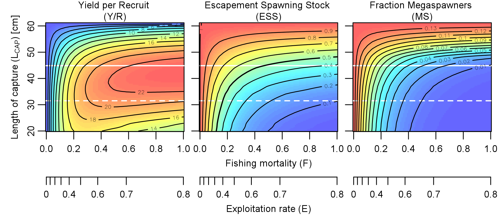

```{r setup, include=FALSE}
knitr::opts_chunk$set(
  echo = TRUE,
  fig.width=6, fig.height=5,
  cache=TRUE,
  fig.pos = "H"
)
```


\vspace{50pt}


```{r, echo=FALSE, fig.align="center"}
# img <- readJPEG("figures/Turtle_golfina_escobilla_oaxaca_mexico_claudio_giovenzana_2010.jpg")
knitr::include_graphics("figures/Turtle_golfina_escobilla_oaxaca_mexico_claudio_giovenzana_2010.jpg", dpi = 150)
```

\newpage

# R Basics

## Starting an R session

### Using scripts
A "Script" is a text window where coding can be written, manipulated and introduced to the Workspace (with ctrl Enter). These can be saved to the Directory folder as well. This will save time in the future when we have several lines of code to introduce. Within the script, we write all necessary commands. To make simulation experiments, we execute the script to run the model.

Open a new script (">>File>>New script …") and copy the following lines of code (in blue below) into the script window:

```{r}
x = 5 
y = 3
x * y
```

\vspace{24pt}
### Starting settings
For each analysis that you do in R, it may be helpful to customize your settings so that you can keep all related information together. In the following example, the R script contains specific path definitions to data locations, function locations, and the working directory has been set. In the script, two objects are exported to the previously defined working directory.

```{r, eval=FALSE}
###Required paths
wd_path <- "/Users/mta/Dropbox/COURSE_ModConsBio/"
fun_path <- "/Users/mta/Dropbox/COURSE_ModConsBio/functions/"

#Define working directory
getwd()
setwd(wd_path)

#script
write.table(iris, file="iris.txt", row.names=FALSE)
read.table("iris.txt", header=TRUE)

png("tmp.png")
plot(1)
dev.off()

```

You also have the possibility to define your directory within the RGui itself (File >> Change directory)

If you want to save the state of your R session for later use, you can use `save.image()` or save the workspace within the Rgui (File >> Save Workspace). You are also prompted with this option when closing R, but you must be sure to save over your previous version if one was created. 
Note: I never save my workspace – If you organize your script well, then you can very easily re-run it at startup to get back to the point you were at.


### Loading packages, writing and sourcing functions

Several recommended packages come installed with the base version of R (e.g. MASS, lattice), while others can be downloaded via the Comprehensive R Archive Network ("CRAN"): <http://cran.r-project.org/>. Below is a script that shows how to install some packages needed during this course. You will be prompted by a window to choose CRAN mirror location: select somewhere close by.

Once installed, packages will need to be loaded during the setup of each R session. This is accomplished with either the `library()` or `require()` functions, which should be added to the beginning of your script.

```{r}
#A helpful package
# install.packages("vegan")

#Example of loading a package
library(lattice)
levelplot(matrix(runif(100), 10, 10))
```


\vspace{24pt}

## Language description
###	Variables
When R encounters a new variable name, it automatically creates the variable and allocates the appropriate amount of storage. If the variable already exists, R changes its contents and, if necessary, allocates new storage. For example:

```{r, results = "hide"}
temp = 32
```

creates a variable (1-by-1 matrix) named temperature and stores the value 32 in its single element. R is case sensitive; it distinguishes between uppercase and lowercase letters. `A` and `a` are not the same variable. To view the matrix assigned to any variable, simply enter the variable name. 

```{r, echo=FALSE}
a = 2
```


```{r, eval=FALSE}
a = 2
A #should not be recognized if not already defined
a #should return the value 2 previously defined
```

### Numbers
R uses conventional decimal notation, with an optional decimal point and leading plus or minus sign, for numbers. Scientific notation uses the letter “e” to specify a power-of-ten scale factor. Some examples of legal numbers are (*note:* `options`, e.g. `scipen`, `digits`, will affect the printed output despite higher internal precision):

```{r, results = "hide"}
0.0001  
9.6397238  
1.60210e-20   
6.02252e23
```

### Operators
+ 	Addition 
– 	Subtraction 
* 	Multiplication 
/ 	Division 
^ 	Power 

```{r, results = "hide"}
2+2	
2-3
2*2
2/3
2^3
```


###	Relational

```{r, results = "hide"}
x = 5 
y = 3
x < y #x less than y
x > y #x greater than y
x <= y #x less than or equal to y
x >= y #x greater than or equal to y

# equal/not equal – be careful for numeric comparisons 
# (see ?all.equal, ?identical)
x == y  #x equal to y
x != y  #x not equal to y
```

###	Functions
R provides a large number of standard elementary mathematical functions, including abs, sqrt, exp, sin … etc. Round brackets are used for after the designation of a function and contain the arguments. 

```{r, results = "hide"}
abs(-2) 
sqrt(9)
exp(2)
sin(pi)
```

You can also write your own functions. Functions can contain several arguments to control the calculation. Arguments can be defined by name or by their position within a list of arguments.

```{r, eval=FALSE}
#hypotenuse of a right triangle
hyp <- function(a, b){ sqrt(a^2+b^2) }
hyp(3,4)
hyp(3)

#hypotenuse of a right triangle. Default a=b
hyp2 <- function(a, b=NULL){ 
  if(is.null(b)) b <- a
  sqrt(a^2+b^2) 
}
hyp2(3,4)
hyp2(3)

#example of argument order
lm.coef <- function(x,y){
  fit <- lm(y ~ x)
  coef(fit)
}
x <- 1:10
y <- 5 + 2*x

lm.coef(x,y)
lm.coef(y,x)
lm.coef(y=y,x=x)

# Another example of function wrapping for a plot style
funky.plot <- function(x,y){
  op <- par(bg=1, mar=c(1,1,4,4))
  plot(x,y, pch=21, col=4, bg="yellow", lwd=2, cex=2)
  axis(3, col="yellow", lwd=2, col.axis="yellow")
  axis(4, col="yellow", lwd=2, col.axis="yellow")
  box(col="pink", lwd=3)
  par(op)
}
funky.plot(x,y)
```

\vspace{24pt}

## Object types
### Matrix (Multi-dimensional - numeric, integer)
It is usually best to think of all numerical sets as matrices. 1 X 1 matrices are referred to as "scalars" (ex. `N = 2`, is a 1 X 1 matrix called "N"), and matrices with only one row or column are referred to as "vectors".

```{r}
N=2
N
as.matrix(N)
```


A vector is just a single list of values; like a row or column in a matrix.
`a = c(16,5,9,4)` # creates a single vector using the `c()` function (programming term: "concatenate"); after entering, type "a" and enter to view the vector

The Colon operator, `:`, can be used for a vector containing a series of values.
`b = 1:10`

The `seq()` command can be used to create a vector of non-unit spacing. One specifies the start, end, and increment:

```{r, results = 'hide'}
seq(from=0,to=100,by=4)
# alternate; the colon operator has "high priority" 
# in the order of operations performed
4*0:25
```

An example matrix appears in the Renaissance engraving "Melancholia I" by the German artist and amateur mathematician Albrecht Dürer. This image is filled with mathematical symbolism. The matrix in the upper right corner is known as a magic square and was believed by many in Dürer`s time to have genuinely magical properties. 

```{r, echo=FALSE, fig.align="center", fig.cap="Albrecht Dürer - Melencolia I"}
knitr::include_graphics("figures/Albrecht_Duerer_-_Melencolia_I_-_Google_Art_Project_(_AGDdr3EHmNGyA).jpg", dpi = 100)
```


We will start by entering the Dürer's matrix. Here are a few examples of entering vectors and arrays or matrices:

```{r}
# first the elements are given
# then the dimensions of the matrix
# must be rectangular
# elements are filled by column
A = matrix(c(16,5,9,4,3,10,6,15,2,11,7,14,13,8,12,1), nrow=4, ncol=4)
# This is Dürer's matrix
A
```

```{r}
# Alternate way of creating an array of vectors
# will create a matrix by repeating the given vector 
# until the matrix dimensions are full.
array(c(16,5,9,4,3,10,6,15,2,11,7,14,13,8,12,1), dim=c(7,6)) 
```

Or, one can make a matrix by cycling a vector of numbers:
```{r}
array(0, dim=c(7,6)) # a single value 0 is cycled until the array/matrix is full
matrix(c(5,1), nrow=4, ncol=4) # the vector c(5,1) is cycled until the matrix is full
```

Why is this Dürer matrix magic? You are probably aware that the special properties of this "magic square" have to do with the various ways of summing elements. If you take the sum along any row or column, or along either of the two main diagonals, you will always get the same number. Try the following statements in R:

```{r, results = 'hide'}
# Ex. sum, transpose, and diagonal
rowSums(A) 
colSums(A) # or rowSums(t(A))
# You can easily pick off the elements of the 
# main diagonal with the help of the diagonal function.
sum(diag(A))  

sum(diag(A[,4:1])) # to get the other diagonal
sum(diag(A[,rev(seq(ncol(A)))])) # more flexible version
```


Picking off vector and matrix elements
To recall values from a previously defined matrix, we use brackets, `[]`, to define specific elements. For a 1 X 1 matrix,

```{r, results = "hide"}
temp = 32 # defines the 1 X 1 matrix
temp # will return the single value, or
temp[] # empty brackets always return the entire matrix; in this case, a single value
```

For a vector,
```{r, results="hide"}
a[2] #calls the value at a certain position of the vector
```

For a multidimensional matrix, the element in row `i` and column `j` of `A` is denoted by `A[i,j]`. For our magic square,

```{r, results="hide"}
A[3,2] # will call a specific row by column value of the matrix [row,column]
c(A[1,4], A[2,4], A[3,4], A[4,4]) #To pick off all elements off the last column 
A[,4] # more elegant
# does the same, but first solves for the length of row 1 (=4 elements), 
# and this value gets placed in the column position of the brackets.
A[,length(A[1,])] 
```

Portions of a matrix can be picked off by expressions involving the colon like A[1:k, j]. For example,
```{r, results="hide"}
A[1:3,4] # picks off the first three elements of the 4th column  
A[1:3,3:4] # picks off the first three elements off the 3rd and 4th columns
```

Sometimes it is necessary that you delete rows and columns of a matrix. 
```{r, results="hide"}
X = A[,-3] # creates a new matrix, X, with all elements of A minus the 3rd column
X 
```

\vspace{24pt}
> **TASK:** Create the 10x10 matrix called "R", which has sequential elements 4-400 (by 4) (Use `seq()` function):

```{r, echo=FALSE}
R <- matrix(seq(from = 4, to = 400, by = 4), nrow = 10, ncol = 10)
R
```


> **EXTRA TASK:**  Can you also create the same matrix using " `:` " function?


\vspace{24pt}


Certain mathematical functions will only accept these types of objects, which also fall within the larger `numeric()` or `integer()` class categories.


\newpage
### Dataframes (2d - mixture of classes)
Data frames are the backbone of most statistical model building in R. They can contain a mixture of variable classes (e.g. `numeric`, `factor`, `character` [i.e. text], `Date`, etc.), thus making them attractive for holding different types of information in a data set. For the purposes of model building, it is helpful to think of a data frame is as a collection of variables (columns) that consisting of a set of samples (rows).

```{r, results="hide"}
a=seq(1:10)
b=letters[1:10]
d=seq(as.Date("2001-01-01"), as.Date("2001-01-10"), by="days")

df <- data.frame(a,b,d)
class(df)
class(df$a)
class(df$b);df$b # by default, character strings are converted to a factor class
class(df$d)
head(df)

df <- data.frame(a,b,d, stringsAsFactors=FALSE)
class(df$b);df$b
as.factor(df$b) # class conversion
str(df) # display structure of object

#A popular multivariate dataset example
data(iris)
head(iris) # contains 4 numeric variables and one factor (Species)
iris$Species
levels(iris$Species) #gives factor levels
```


### Lists	(multimimensional - mixture of classes)
Lists are another type of object that can contain a collection of variables. One difference as compared to a data frame is that the variables may be of differing length / dimension, and are thus often used to hold results for specific functions. 

```{r, results="hide"}
# list creation
L <- list(a, b, d)
L
L <- list(a=a, b=b, d=d)
L

# list conversion
iris2 <- as.list(iris)
iris2
names(iris)
iris2[1]
iris2$Sepal.Length

# results of lm() is a list-like object
x <- 1:10
y <- 5 + 2*x + rnorm(10)
fit <- lm(y ~ x)
fit
names(fit)
fit$coefficients
fit[1]
fit$residuals
```


\vspace{24pt}

## Data manipulation
We have already seen some matrix-type operations above with `colSums` and `rowSums`. Some more pre-made functions also exist, e.g. `colMeans` and `rowMeans`, but more generally these functions are wrappers for apply-family of functions (`apply`, `lapply`, `sapply`, `vapply`, `tapply`, and `mapply`). For a nice overview, see [this stackoverflow answer](http://stackoverflow.com/a/7141669/1199289). Here are a few examples for the most commonly used apply function. 

```{r, results="hide"}
A = matrix(c(16,5,9,4,3,10,6,15,2,11,7,14,13,8,12,1), nrow=4, ncol=4) 
A
apply(A, 1, sum)
apply(A, 2, sum)

#define own function
rms <- function(x) sqrt(sum(x^2))
apply(A, 2, rms)
```


Another group of functions can be used for so-called "split-apply-combine" operations (`aggregate`, `by`). 

```{r, results="hide"}
tmp <- aggregate(iris$Sepal.Length, list(iris$Species), FUN = mean) # data frame
tmp
class(tmp)
tmp$x

aggregate(Sepal.Length ~ Species, iris, FUN=mean) # formula notation

tmp <- by(iris$Sepal.Length, iris$Species, mean)
tmp
class(tmp)
tmp[1]
as.vector(by(iris$Sepal.Length, iris$Species, mean))
```

***NOTE:*** The `dplyr` package gives a lot of flexibility to these types of functions and is worth learning. e.g.:

```{r, results="hide"}
library(dplyr)

# returns a new data.frame
iris |> summarise(meanSL = mean(Sepal.Length), .by = Species)

# adds new variable to a new data.frame
iris |> mutate(meanSL = mean(Sepal.Length), .by = Species)
```


\vspace{24pt}

## Control-flow (looping, conditional)
Iterative calculations can be written using looping functions like `for()` and `while()`.  For has a defined number of iterations and while will continue until a condition is met. Note that curly brackets `{}` are used to define the contents of the loop when divided over several lines of code.

```{r, results="hide"}
iter <- 100
x <- 0
for(i in seq(iter)){
  x <- x + runif(1)
  print(x)
}

x <- 0
i <- 0
while(x < 100){
  i <- i + 1
  x <- x + runif(1)
  print(cbind(i, x))
}
```


Conditional control can be done with `if{...}else{...}` and `ifelse(eval, if.true, if.false)` type functions.  I prefer the prior due to the fact that I can better visualize and control the flow of operations. Again, curly brackets are used to define the code if broken over several lines.

```{r, results="hide"}
x <- 50
if(x < 100) print("x is less than 100")

x <- 100
if(x < 100) {
  print("x < 100")
} else {
  print("100 <= x")
}

x <- 120
if(x < 100) {
  print("x < 100")
  } else {
    if(x >= 100 & x < 200){
      print("100 <= x < 200")
    } else {
      print("200 <= x")
    }
}

# ?Control # for more detail
```


\vspace{24pt}

## Generating random numbers
### Distributions

Several different types of random number distributions are available in ***R*** (see [Short-refcard.pdf](https://cran.r-project.org/doc/contrib/Short-refcard.pdf), section "Distributions"). We will cover 2 basic examples for uniform and normal distributions. 

```{r, results="hide"}
# produces 20 random elements of uniform distribution. 
# minimum and maximum values are defined
runif(20, min=0, max=10) 

# to round the resulting numbers to a specified digit (toward zero)
round(runif(20, min=0, max=10),digits=0) 

# produces 20 random elements of normal distribution. 
# mean and standard deviation are defined
rnorm(20, mean=10, sd=5) 

q <- runif(500, min=0, max=10)
w <- rnorm(500, mean=10, sd=5)

# visualize
hist(q); abline(v=mean(q),col=2,lwd=2)
# "breaks" argument defines the number of histogram cells
hist(w, breaks=50); abline(v=mean(w),col=2,lwd=2) 
```


### Seeding a random number sequence
The `set.seed()` command defines a starting point for the random number generator (default: `kind = "Mersenne-Twister"` (Matsumoto and Nishimura, 1998) with period 2^19937 – 1). By defining a starting point for the cycling of values (with an integer), one can reproduce results.

```{r, results="hide"}
set.seed(1234)
r = rnorm(20, mean=10, sd=5)  
r # to view the resulting vector
sum(r)
```

> **TASK:**  Try repeating only the last 3 lines of code – the result will be different without resetting the seed value.

\vspace{24pt}

## Importing and exporting data

The functions `write.table()` and `read.table()` provide a (relatively) easy way to export and import data. Details to take care of are the type of delimitation used in the file, and the existence of column names ("header") and row names. By default, these functions assume a space delimiter and automatically detect row names and headers based on whether the first row contains a value fewer than the rest of the rows. Importing data from EXCEL to R is easily done by saving the spreadsheet as a .csv file and then using the `read.csv()` or `read.csv2()` (German ";" and "," decimal delimiters). 
The `sink()` function may be helpful in exporting text output from R, which may be of interest in the creation of summary statistics tables using another program.

```{r, eval = FALSE, results="hide"}
write.table(iris, file="iris.txt")
tmp <- read.table(file="iris.txt")
tmp

# for easier reading in EXCEL
write.table(iris, file="iris2.txt", sep="\t", row.names=FALSE)
tmp <- read.table(file="iris2.txt", sep="\t", header=TRUE)
tmp

write.csv(iris, file="iris3.csv")
tmp <- read.csv(file="iris3.csv", row.names=1)
tmp

# Create a text file based on R output
x <- 1:10
y <- 5 + 2*x 
fit <- lm(y ~ x)

sink("sink-example.txt") # opens the sink to an external text file 
summary(fit)
getwd() 
sink() # closes the sink
# unlink("sink-example.txt") # run unlink to remove file
```


Reading tables into R results in automatic classification as a `data.frame`. Dataframes are slightly different from an `array` or `matrix` in that they can allow for both numeric, text and/or factor type entries within the same table.  This is helpful for some statistical analyses where factors need to be compared.

***NOTE:***: The function `scan()` provides more flexibility for importing data from other data types.

\vspace{24pt}

## Plotting
###	The basics

The `plot()` accepts different combinations of input arguments. If y is a vector, `plot(y)` produces a piece-wise linear graph of the elements of `y` versus the index of the elements of `y`. 

```{r}
y=c(1:10)
plot(y)
```

 
If you specify two vectors as arguments, `plot(x,y)` produces a graph of `x` versus `y`. For example, to plot the value of the sine function from zero to 2*pi, use
```{r}
x=seq(from=0,to=2*pi, by=pi/100)
y=sin(x)
plot(x,y,type="l") 
```
 

### High- vs low-level plotting commands
To add additional components to your graph, you can use "low-level" plotting commands
```{r}
y2 = sin(x-0.25) 
y3 = sin(x-0.5) 
plot(x,y,type="l") #this is the high level plotting command
lines(x,y2,col=2) # this is the low-level plotting command
lines(x,y3,col=3) # again, a low-level plotting command
```
 

Additional graphical parameters can be added to both high-level and low-level plotting commands to define things like color, point size, symbol, line type, etc. Try out some of the plotting possibilities (see the section on graphical parameters in the [Short-refcard.pdf](https://cran.r-project.org/doc/contrib/Short-refcard.pdf) file, or type `?plot` and return for a full description of the function options).

```{r}
plot(x,y, col=6, type="l", lwd=6, lty=5)
```

The `plot()` command is a "high level" plotting command, which will replace the plot in the ACTIVE graphical device. In order to add components, we use the lower level plotting commands (see Short-refcard.pdf for helpful examples). To create a new plot without losing the old one, you must open a new graphic window using one of the two following commands:
```{r, eval=FALSE}
windows() # Windows
x11() # Windows & (sometimes) Mac
quartz() # Mac
```


The most recently created window is now the active one for future plot commands.


### Creating multiple plots
By default, a plotting window will contain a single plot. We can change this by using the global `par()` command – defines parameters of the plot globally. This command also allows one to define the number of sub-plotting regions to be cycled through:

```{r}
# defines that the graphic device is split into 2 rows by 2 cols
# and will be drawn by row (as opposed to "mfcol", 
# which draws in order of column)
op <- par(mfrow=c(2,2))  
x1=rnorm(1000) # default of rnorm has mean=0 and sd=1 
x2=rnorm(1000, mean=0, sd=3)
x3=rnorm(1000, mean=5, sd=1)
x4=rnorm(1000, mean=5, sd=3)
ran.x<-range(c(x1,x2,x3,x4))
levs<-pretty(ran.x, 20)
# histogram plots
hist(x1, xlim=ran.x, breaks=levs, col="grey") 
hist(x2, xlim=ran.x, breaks=levs, col="grey")
hist(x3, xlim=ran.x, breaks=levs, col="grey")
hist(x4, xlim=ran.x, breaks=levs, col="grey")
par(op)
```


For further control of sub-figure dimensions, use `layout()`. 
```{r}
# layout example
op <- par(mar=c(5,5,1,1), cex=0.7)
layout(matrix(c(1,1,1,2,3,4),nrow=3,ncol=2, byrow=FALSE),
  widths=c(5,2), heights=c(2,2,3), respect=TRUE)
# layout.show(4)
hist(x1, xlim=ran.x, breaks=levs, col="grey")
hist(x2, xlim=ran.x, breaks=levs, col="grey")
hist(x3, xlim=ran.x, breaks=levs, col="grey")
hist(x4, xlim=ran.x, breaks=levs, col="grey")
par(op)
```


 
```{r}
# layout example 2 - inset figure
par(mar=c(5,5,1,1), cex=0.7)
layout(matrix(c(1,1,2,1),nrow=2,ncol=2, byrow=FALSE), 
  widths=c(3,2), heights=c(2,3), respect=TRUE)
# layout.show(2)
hist(x1, xlim=ran.x, breaks=levs, col="grey")
par(mar=c(5,5,1,1), cex=0.7)
hist(x2, xlim=ran.x, breaks=levs, col="grey")
```

 
### Exporting graphics
When running R in a stand-alone window, you may have the option to save graphics directly from the File menu (>>File>>Save as):

```{r, echo=FALSE, fig.align="center"}
knitr::include_graphics("figures/export_directly_from_device.png", dpi = 200)
```
 
Or, you can use the following functions to save an active device:
```{r, eval=FALSE}
x11()
hist(x1, xlim=ran.x, breaks=levs, col="grey") # a histogram plot
dev.copy2pdf(file="plot.pdf", out.type = "pdf")
dev.copy2eps(file="plot.eps")
# allows some control over resolution and size
dev.print(file="plot.png", device = png, width=7, height=7, 
  units="in", res=400, type="cairo") 
```

For more control, you can opt for sending plotting commands to a specific plotting device output type:

```{r, eval=FALSE}
jpeg("plot.jpeg")
hist(x1, xlim=ran.x, breaks=levs, col="grey") # a histogram plot
dev.off()

png("plot.png", width=6, height=6, units="in", res=400)
hist(x1, xlim=ran.x, breaks=levs, col="grey") # a histogram plot
dev.off()

pdf("plot.pdf", width=6, height=6)
hist(x1, xlim=ran.x, breaks=levs, col="grey") # a histogram plot
dev.off()

require(Cairo) #vector graphic that is easily imported into graphics editing programs
CairoSVG("plot.svg", width = 6, height = 6)
hist(x1, xlim=ran.x, breaks=levs, col="grey") # a histogram plot
dev.off()
```

\newpage

# Statistical model building in R

## Model formulation

Most statistical models in R contain a formula argument. The formulation differs by model type, but similarities exist in the general formatting of response and predictor variables. For General Linear Models (LM) and Generalized Linear Models (GLM), the following section outlines the main rules for defining formulas. Many other model types use the basic language of these formulas, so understanding their 

[From R Help: `?formula`] – "The models fit by, e.g., the `lm` and `glm` functions are specified in a compact symbolic form. The ~ operator is basic in the formation of such models. An expression of the form `y ~` model is interpreted as a specification that the response y is modeled by a linear predictor specified symbolically by model. Such a model consists of a series of terms separated by `+` operators. The terms themselves consist of variable and factor names separated by `:` operators. Such a term is interpreted as the interaction of all the variables and factors appearing in the term.

"In addition to + and :, a number of other operators are useful in model formulae. The * operator denotes factor crossing: `a*b` interpreted as `a+b+a:b`. The `^` operator indicates crossing to the specified degree. For example `(a+b+c)^2` is identical to `(a+b+c)*(a+b+c)` which in turn expands to a formula containing the main effects for `a`, `b` and `c` together with their second-order interactions. The `%in%` operator indicates that the terms on its left are nested within those on the right. For example `a + b %in% a` expands to the formula `a + a:b`. The - operator removes the specified terms, so that `(a+b+c)^2 - a:b` is identical to `a + b + c + b:c + a:c`. It can also be used to remove the intercept term: when fitting a linear model `y ~ x - 1` specifies a line through the origin. A model with no intercept can be also specified as `y ~ x + 0` or `y ~ 0 + x`.

"While formulae usually involve just variable and factor names, they can also involve arithmetic expressions. The formula `log(y) ~ a + log(x)` is quite legal. When such arithmetic expressions involve operators which are also used symbolically in model formulae, there can be confusion between arithmetic and symbolic operator use. 

"To avoid this confusion, the function `I()` can be used to bracket those portions of a model formula where the operators are used in their arithmetic sense. For example, in the formula `y ~ a + I(b+c)`, the term `b+c` is to be interpreted as the sum of `b` and `c`."

**Examples:**
```{r eval=FALSE, include=TRUE}
# "~" denotes response variable to the left, "+" separates terms
fmla <- formula(y ~ a+b)
attr(terms(fmla), "term.labels")
# [1] "a" "b"

# ":" denotes interaction
fmla <- formula(y ~ a:b + c)
attr(terms(fmla), "term.labels")
# [1] "c"   "a:b"

# "*" denotes single terms plus all orders of interaction
fmla <- formula(y ~ a*b)
attr(terms(fmla), "term.labels")
# [1] "a"   "b"   "a:b"

fmla <- formula(y ~ a*b*c) # All terms plus interaction
attr(terms(fmla), "term.labels")
# [1] "a"     "b"     "c"     "a:b"   "a:c"   "b:c"   "a:b:c"

#"^" denotes order upper level for interactions conbinations
fmla <- formula(y ~ (a+b+c)^2) #second-order interactions
attr(terms(fmla), "term.labels")
# [1] "a"   "b"   "c"   "a:b" "a:c" "b:c"

fmla <- formula(y ~ (a+b+c)^3) #third-order interactions
attr(terms(fmla), "term.labels")
# [1] "a"     "b"     "c"     "a:b"   "a:c"   "b:c"   "a:b:c"

# "-" denotes term removal
fmla <- formula(y ~ (a+b+c)^3 - a:b:c) #third-order interactions
attr(terms(fmla), "term.labels")
# [1] "a"   "b"   "c"   "a:b" "a:c" "b:c"

# "I()" denotes arithmatic use of operators
fmla <- formula(y ~ a+I(b^3)) #third-order interactions
attr(terms(fmla), "term.labels")
# [1] "a"      "I(b^3)"

# "1" denotes the intercept term. It is automatically included unless specified
# with intercept
fmla <- formula(y ~ a+b + 1) # with intercept
attr(terms(fmla), "term.labels"); attr(terms(fmla), "intercept")
# [1] "a" "b"
# [1] 1

# minus intercept version 1
fmla <- formula(y ~ a+b - 1)
attr(terms(fmla), "term.labels"); attr(terms(fmla), "intercept")
# [1] "a" "b"
# [1] 0

# minus intercept version 2
fmla <- formula(y ~ a+b + 0)
attr(terms(fmla), "term.labels"); attr(terms(fmla), "intercept")
# [1] "a" "b"
# [1] 0
```


**What does it all mean?**

Let's try a visual example to show how this translates into model specification. The following example will look at a model that explores petal length as a function of sepal length in two species of iris (data set: `iris`). We will start off with the "largest" possible model, which allows for independent linear regressions for each species (i.e. each relationship differs in terms of both intercept and slope).

```{r}
df <- subset(iris, Species %in% c("setosa","versicolor"))
df <- df[order(df$Petal.Length),]
df$Species <- as.factor(as.character(df$Species))
plot(Petal.Length ~ Sepal.Length, df, col = df$Species)
legend("bottomright", legend = levels(df$Species), col = 1:2, pch = 1)

fit <- lm(Petal.Length ~ Sepal.Length*Species, df)
summary(fit)
```

The `summary` of the model is not so straightforward to interpret, but it is showing the coefficients associated with the intercept (`(intercept)`) and slope (`Sepal.Length`) of the *first* iris species (i.e. first level in the factor `Species`, "setosa"; `levels(df$Species)`). The regression of the second species (i.e. "versicolor") is based on additional modifications to this baseline model in terms of intercept and slope; i.e. the intercept of the *versicolor* model is `0.8031 - 0.6179 = 0.1852`, and its slope is `0.1316 + 0.5548 = 0.6864`. This can be better visualized by returning the predictions of the model.

```{r}
df$pred <- predict(fit)
plot(Petal.Length ~ Sepal.Length, df, col = df$Species)
legend("bottomright", legend = levels(df$Species), col = 1:2, pch = 1)
lines(pred ~ Sepal.Length, data = subset(df, Species == "setosa"))
lines(pred ~ Sepal.Length, data = subset(df, Species == "versicolor"), col = 2)
```

Now we will visualize some of the other possible model formulas in the same way. For the purpose of illustration, we will extend these predictions over a larger range of sepal length values in order to include the y-intercept (`newdata$pred <- predict(fit, newdata = newdata)`).

```{r}
fmla1 <- "Petal.Length ~ Sepal.Length*Species"
fmla2 <- "Petal.Length ~ Sepal.Length + Species"
fmla3 <- "Petal.Length ~ Sepal.Length"
fmla4 <- "Petal.Length ~ Species"
fmla5 <- "Petal.Length ~ 1"
fmlas <- c(fmla1, fmla2, fmla3, fmla4, fmla5)

# new data, used for predicting over a larger range
newdata <- expand.grid(
  Sepal.Length = seq(0, max(df$Sepal.Length), length.out = 10), 
  Species = unique(df$Species))

op <- par(mfrow = c(3,2), mgp = c(2,0.5,0), ps = 8, mar = c(3,3,1.5,0.5))
for(i in seq(fmlas)){
  # fit and predict
  fit <- lm(fmlas[[i]], df)
  newdata$pred <- predict(fit, newdata = newdata)
  # plot
  plot(Petal.Length ~ Sepal.Length, df, col = df$Species, 
    xlim = c(0, max(df$Sepal.Length)), ylim = c(0, max(df$Petal.Length)))
  if(i == length(fmlas)) legend("topleft", legend = levels(df$Species), col = 1:2, pch = 1)
  lines(pred ~ Sepal.Length, data = subset(newdata, Species == "setosa"))
  lines(pred ~ Sepal.Length, data = subset(newdata, Species == "versicolor"), 
    col = 2, lty = 2)
  mtext(fmlas[[i]], side = 3, line = 0.25, adj = 0)
}
par(op)

```

You should see that the models become somewhat simpler towards the bottom plots, where the relationship in both species may only differ in terms of one of the terms, or not at all.

Choosing the best model for a given situation can be difficult if you have many possible options, but, hopefully, hypothesis-driven explorations will help you limit your explorations to a manageable amount. Below is an introduction into some aspects of model selection.


## A strategy for model selection

A large part of model building is selecting the best model to describe the response variable. An important concept to remember when looking for the "best" model is whether the addition of terms improves the predictive power of the model. Generally, the more explanatory variables that one has, the more variation will be explained in the response variable, but one has to be careful not to include variables that do not explain a *significant* portion of the variation. The inclusion of these terms might help you achieve a higher $R^2$ value for your specific data set, but are likely to be a poor predictor of new data that was not seen during the fitting. This problem is referred to as "*over-fitting*".

The strategy presented here relies on the comparison of "*nested models*" in determining whether a term should be kept or not. Nested models differ by a single term, whereby the larger model contains all of the terms of the smaller model, plus an additional one. One commonly used strategy, is to start with your most complex model (e.g. the model above that included species, petal length, and their interaction) and work backwards, trying to sequentially remove variables that are not significant. 

As a general rule, one should start by removing higher-order terms first (e.g. interaction terms) before moving on main terms or lower-level nested terms. Furthermore, some believe that there is a general rule stating that the main term should always be included if the term is also used in an interaction (see discussion here: <http://stats.stackexchange.com/q/11009/10675>)

This logic is within the automated stepwise search routine found in the function `step()` (introduced below), which usually makes sense, however it is definitely not a hard and fast rule. A basic guideline might be to try and formulate models are plausible given your specific question, and treat the inclusion of terms as hypotheses to be tested (see discussion here: <http://stats.stackexchange.com/q/4901/10675>). 

> **TASK:** Some of the above models for sepal length show a negative prediction at small petal lengths. Is there another, more realistic, model that might be fit?


### ANOVA, F-test

Most biologists may have surely come across Analysis of Variance (ANOVA), used for testing the difference in mean values for 2 or more groups; e.g. in evaluating whether a given treatment has has a significant effect on some response variable. Whether you noticed it or not, one can think of this in terms of linear models and the testing of whether the "effect" (factor) term should be included. Again we will use the `iris` data set for this illustration, and will compare whether sepal length differs among three species of iris.

In the vein of nested model testing, the "large" model will be one that contains the "Species" term, while the "small" one will not. First, let's fit both models and visualize the results:

```{r}
# large model
# "1" included for consistency, but intercept inclusion is by default
fitL <- lm(Sepal.Length ~ 1 + Species, data = iris)

# small model
fitS <- lm(Sepal.Length ~ 1, data = iris)

# plot
COL <- rainbow(3)
COLtrans <- adjustcolor(COL, 0.2)
boxplot(Sepal.Length ~ Species, data = iris, col = COLtrans, border = 1)
abline(h = fitS$coeff[1], lwd=3, lty=2, col=8)
abline(h = fitL$coeff[1], col=COL[1], lwd=3, lty=2)
abline(h = fitL$coeff[1]+fitL$coeff[2], col=COL[2], lwd=3, lty=2)
abline(h = fitL$coeff[1]+fitL$coeff[3], col=COL[3], lwd=3, lty=2)
```

From a first glance, it would certainly look like there is a significant difference in sepal length among the iris species, but we can test this explicitly by comparing the nested models via `anova()`. Indeed, the test shows a highly significant effect according to the p-value:

```{r}
anova(fitS, fitL)
```

What this test is doing is testing whether the improvement in residual error by the large model is sufficiently large given its higher degrees of freedom. For comparison, here is a manual calculation of the F-test:

```{r}
# analysis of residual sum of squares of lm() fitted models
arss <- function(small.model, big.model){
  F.value <-((sum(resid(small.model)^2) - sum(resid(big.model)^2)) / 
    (summary(big.model)$df[1]-summary(small.model)$df[1])) / 
    (sum(resid(big.model)^2)/(summary(big.model)$df[2]))
  P.value <- pf(F.value, (summary(big.model)$df[1]-summary(small.model)$df[1]), 
    summary(big.model)$df[2], lower.tail = FALSE)
  return(list(F.value = F.value, P.value = P.value))
}

arss(small.model = fitS, big.model = fitL) 
```

**A larger example (polynomial fitting)**

In the following example, we have four nested models - polynomials of increasing complexity.  

```{r}
df <- structure(list(x = c(233, 286, 386, 554, 201, 549, 572, 430, 
415, 131, 203, 188, 444, 292, 485, 349, 459, 596, 290, 489), 
    y = c(219, 222, 235, 213, 193, 257, 254, 274, 269, 136, 190, 
    178, 258, 177, 272, 236, 255, 221, 206, 268)), .Names = c("x", 
"y"), row.names = c(NA, -20L), class = "data.frame")

# compare polynomial fits of increasing degree
lm1 = lm(y ~ x, data=df)
lm2 = lm(y ~ x + I(x^2), data=df)
lm3 = lm(y ~ x + I(x^2) + I(x^3), data=df)
lm4 = lm(y ~ x + I(x^2) + I(x^3) + I(x^4), data=df)

newdata <- data.frame(x=seq(min(df$x),max(df$x),length.out=100))
plot(y ~ x, df)
lines(newdata$x, predict(lm1, newdata), col=2)
lines(newdata$x, predict(lm2, newdata), col=3)
lines(newdata$x, predict(lm3, newdata), col=4)
lines(newdata$x, predict(lm4, newdata), col=5)

legend("topleft", legend=paste("deg.", 1:4), col=2:5, lty=1, 
  title="polynomial type")
```

> **TASK:** Using `anova()`, see if you can arrive to the best model by eliminating insignificant terms.


### Akaike Information Criterion (AIC) and stepwise search

If you are in a situation where you are unable to reduce the number of possible explanatory variables to a manageable number, you may need other strategies to compare model performance. The Akaike Information Criterion (AIC) is a statistic that can be used when comparing several models of similar structure (not appropriate to compare models with different underlying formulation; e.g. glm vs glmm). The AIC is a measure of the relative quality of a statistical model, and thus can be used to for model selection. AIC should be smallest in the best model, as it also infers a penalty depending on the degrees of freedom. It is important to emphasize that AIC is a relative measure of fit, and not a measure of significance, such as the F-test outlined above. However, a general rule of thumb is that a differences of >2 in AIC will usually relate to a p-value < 0.05.

```{r}
AIC(lm3, lm4)
```

The `step()` function does an automated search for the best candidate LM/GLM model through comparison of nested models using AIC. The search can be specified as one of "both", "backward", or "forward", with a default of "both". Furthermore, interaction terms are only included if the main interaction is also included. Generally, a stepwise search can be helpful in looking for the combination of terms that produces the lowest AIC; however, it is possible that the algorithm does not find the best model since not all term combinations may be fit. 

A (ridiculously) complex model for predicting sepal length in the iris data set would be to include all other morphometric data and the species factor. One shortcut to this formulation is to use `~ .` as a way to include all variables besides the response variable. If we want the interaction terms as well, we would raise this term to the desired maximum degree of interaction. In the following example, we will start with this complex model and try to reduce it to a smaller, but more robust set of terms. 

```{r eval = FALSE}
# full model, up to a 4-degree interaction term
fit0 <- lm(Sepal.Length ~ (.)^4, data = iris) 
summary(fit0)

# the stepwise search
fit1 <- step(fit0, direction = "both")

# possible further manual removal
fit2 <- update(fit1, .~.-Petal.Width:Species)
```


### Things we have not dealt with

The above examples were for relatively simple univariate linear models, which may not be appropriate for your data. The objective was not to introduce you all possible models, but rather to familiarize you with the language of formulating statistical models and simple hypothesis testing. Other aspects that you may need to consider are whether the relationships are better defined by non-linear functions (e.g. Generalized Additive Models, GAMs), dealing with non-normally distributed data (see `?family`, for use in e.g `gam` and `glm`), comparing model performance between non-nested models (e.g. via cross validation), identifying violations in residual patterns (e.g. heteroscedasticity), and many other topics. Hopefully, by reading related literature, and seeing examples for methods employed, you will be able to expand your R-literacy to meet the needs of your specific problem. 


## Non-linear model fitting

### Nonlinear Least Squares

You will be dealing with nonlinear models later in the course. Contrary to linear models, whose coefficients can be estimated directly, nonlinear model coefficients must be estimated iteratively, using numerical optimization algorithms to determine the best-fitting parameters. The most common method is nonlinear least squares, which comes comes with the base installation of R (`nls()`). This function uses a [https://en.wikipedia.org/wiki/Gauss%E2%80%93Newton_algorithm](Gauss-Newton algorithm) by default, but there are other methods available. In the following example, we will be fitting a von Bertalanffy growth function (`vbgf`) to length-at-age data, which is commonly used to describe growth in many fish stock assessments. The function will then search for the parameters that minimize the sum of squared errors (*SS*).    

```{r}
# generate data
set.seed(1)
n <- 100
linf <- 60
k <- 0.2
t0 <- -0.1
age <- round(runif(n, min = 1, max = 10))
length <- linf*(1-exp(-k*(age-t0))) * rlnorm(n, sdlog = 0.1)
df <- data.frame(age = age, length = length)
plot(length ~ age, df, xlim = c(0, max(df$age)), ylim = c(0, max(df$length)))

vbgf <- function(linf, k, t, t0){linf * (1 - exp(-(k * (t - t0))))}

fit <- nls(length ~ vbgf(linf, k, t0, t = age), data = df,
  start = list(linf = 70, k = 0.1, t0 = -0.5), 
  lower = list(linf = 40, k = 0.01, t0 = -1), 
  upper = list(linf = 100, k = 1, t0 = 1), algorithm = "port")
sol <- summary(fit)$coef[,1]

df$pred <- predict(fit)
newdat = data.frame(age = seq(0, max(df$age), length.out = 100))
newdat$length <- vbgf(linf = sol["linf"], k = sol["k"], t0 = sol["t0"], 
  t = newdat$age)
grid()
lines(length ~ age, newdat, col = 4)
text(0, max(df$length)*0.9, pos = 4, col = 4,
  labels = paste0("SS = ", round(sum((df$pred-df$length)^2))))
text(8, 10, col = 4,
  labels = paste0(names(sol), " = ", round(sol, 2), collapse = "\n"))

```

### More general optimization

If you want a bit more flexibility in how the model fit is minimized, you can define your own metric for minimization with `optim()`. For example, the above generated data has errors that increase with length, so it might be more appropriate to minimize the error in log space. The set-up is only slightly different; one embeds the `vbgf` inside of another function whose output is the metric to be minimized. In this case, I have chosen to use root mean squared error (*RMSE*) of log-transformed length. Here the search method is also a variation of a Newton algorithm, with box constraints (i.e. upper and lower parameter limits defined for the search).

```{r}
fitfun <- function(par = c(linf, k, t0), data = df){
  pred <- vbgf(linf= par[1], k = par[2], t0 = par[3], t = data$age)
  rmse <- sqrt(mean((log(data$length) - log(pred))^2, na.rm = T))
  return(rmse)
}

fit <- optim(par = c(linf = 70, k = 0.1, t0 = -0.5), 
  fn = fitfun, 
  data = df,
  lower = c(linf = 40, k = 0.01, t0 = -1), 
  upper = c(linf = 100, k = 1, t0 = 1), 
  method = "L-BFGS-B")
sol <- fit$par

df$pred <- vbgf(linf = sol[1], k = sol[2], t0 = sol[3], t = df$age)
newdat = data.frame(age = seq(0, max(df$age), length.out = 100))
newdat$length <- vbgf(linf = sol["linf"], k = sol["k"], t0 = sol["t0"], 
  t = newdat$age)
plot(length ~ age, df, xlim = c(0, max(df$age)), ylim = c(0, max(df$length)))
grid()
lines(length ~ age, newdat, col = 4)
text(0, max(df$length)*0.9, pos = 4, col = 4,
  labels = paste0("RMSE = ", 
  round(sqrt(mean((log(df$pred)-log(df$length))^2)), 4)))
text(8, 10, col = 4,
  labels = paste0(names(sol), " = ", round(sol, 2), collapse = "\n"))

```


### Specialized algorithms

In the above example, the optimal solution is likely to be clearly defined, but there may be other cases where the search algorithm gets stuck in a "local minimum", and does not find the best solution. This situation is illustrated in the figure below, where there is not a unimodal pattern to the parameter space.

```{r, echo=FALSE, fig.align = "center", fig.pos = "H", fig.cap = "Global and local minima and maxima."}
# img <- readJPEG("figures/Turtle_golfina_escobilla_oaxaca_mexico_claudio_giovenzana_2010.jpg")
knitr::include_graphics("figures/Extrema_example_original.png", dpi = 300)
```

These situations may require optimization algorithms that are less likely to get stuck. One popular method is *simulated annealing* (SA), which is available in the optim function (`optim(, method = "SANN")`). This approach starts off by searching a large parameter space is a quite chaotic fashion, but slowly focuses on areas of minimum score (the analogy is the movement of atoms during a cooling process). 

Another popular method is the use of a *genetic algorithm* (GA), which mimics an evolutionary process by treating parameters like genes, whose values contribute the the *fitness* of each *individual*. Using genetics-inspired processes, such as mutation and crossover, each iteration selects for individuals with the highest fitness to survive and mate, reproducing new individuals with unique parameter/gene combinations in the next generation. As with SA, the algorithm will usually start off with a wide, random set of parameter combinations, which will be continually refined over the generations to focus on areas of highest fitness. The mutation rate is especially important in defining the degree to which the population might escape local minima to explore new areas of the parameter space.

The example of fitting the `vbgf` is probably not plagued by issues of local minima, but is used for consistency with the above methods. Fitting the VBGF to length-frequency data does have issues with local minima, and GA has been applied to such fitting excercises (see `ELEFAN_GA` from the TropFishR package).

```{r}
library(GA)

fitfun <- function(par = c(linf, k, t0), data = df){
  pred <- vbgf(linf= par[1], k = par[2], t0 = par[3], t = data$age)
  rmse <- sqrt(mean((log(data$length) - log(pred))^2, na.rm = T))
  return(-rmse) # flip sign, as ga tries to maximize the fitness
}

fit <- ga(type = "real-valued", fitness = fitfun, 
  data = df, 
  lower = c(linf = 40, k = 0.01, t0 = -1), 
  upper = c(linf = 100, k = 1, t0 = 1), 
  popSize = 50, maxiter = 200,
  monitor = F, seed = 1111)
sol <- fit@solution
# plot(fit)

df$pred <- vbgf(linf = sol[1], k = sol[2], t0 = sol[3], t = df$age)
newdat = data.frame(age = seq(0, max(df$age), length.out = 100))
newdat$length <- vbgf(linf = sol[,"linf"], k = sol[,"k"], t0 = sol[,"t0"], 
  t = newdat$age)

plot(length ~ age, df, xlim = c(0, max(df$age)), ylim = c(0, max(df$length)))
grid()
lines(length ~ age, newdat, col = 4)
text(0, max(df$length)*0.9, pos = 4, col = 4,
  labels = paste0("RMSE = ", 
  round(sqrt(mean((log(df$pred)-log(df$length))^2)), 4)))
text(8, 10, col = 4,
  labels = paste0(colnames(sol), " = ", round(sol, 2), collapse = "\n"))

```


\newpage

# A first model
In our models, it is often necessary to add a number (element) to an existing vector (or matrix). This allows for the iterative computing as well as records a series of calculations that can be looked at later. Try this:

```{r}
# First model, adding to an existing vector
N = 1 # is a 1 X 1 matrix called "N"
# the new definition of N is a vector 
# consisting of the original definition and 2
N = c(N, 2) 
N = c(N, 1) # again, adding an element
N # to see the resulting vector
```


You will need this command to make iterations. Assuming that we want calculate the number of individuals in this time step basing on the number of individuals in the previous time step. All results will be stored within a vector `N`:

```{r}
# First model, adding iterations
N = 1   #initial population size
R = 2   #growth rate
# add to the first element in N the new population
# size is added which is calculated as growth rate * previous population size
N = c(N,R*N[length(N)])
N                       
## iterate the calculation 2 more times (vector "N" is growing...)
N = c(N,R*N[length(N)]) 
N = c(N,R*N[length(N)])
plot(N, t="b")
```

## Adding a looping routine
Loops allow for a command to be repeated a desired number of iterations. Here we will also fill in an empty results vector rather than grow the vector with each loop. This is much more computationally efficient in that 

```{r}
time = 1:100  #time steps
N = NA*time # empty vector of length time
N[1] = 10  # initial population size
R = 1.1 #growth rate

# loop for the calculation
for (i in 2:length(N)){
	N[i] = R * N[i-1]
}

plot(time, N, type="l")	# plot of the result
```

## Incorporating variability
Variability is a reality in the natural world – especially in biological system. We often work with population dynamic parameters that have a defined level of variability. This can be incorporated into our model by describing how the variability of the measured parameter is distributed.

```{r}
time = 1:100  #time steps
N = NA*time # empty vector of length time
N[1] = 10 # initial population size
R = 1.1
R_sd = 0.2
set.seed(1)
Rs <- rnorm(length(N),mean=R,sd=R_sd)

# loop for the calculation
for (i in 2:length(N)){
	N[i] = Rs[i-1] * N[i-1]
}
plot(time, N, type="l") # plot of the result
```

The advantage of this is that we have now left the realm of deterministic modelling. By repeating a simulation that incorporates variability, we are able to define our results with probabilities – helpful in assessing the risk of different conservation strategies. 

```{r}
# First model, adding multiple runs with variability
runs = 100
time = 1:100 # time

# empty matrix where each column will contain the results of a run
N = matrix(NA, nrow=length(time), ncol=runs)	
N[1,] = 10 # initial population size
R = 1.1 # growth rate
R_sd = 0.2 # standard deviation of growth rate
set.seed(1)
Rs <- array(rnorm(length(N), mean=R, sd=R_sd), dim = dim(N))

# loop for each run
for(j in 1:runs){
	# loop for each time step
	for (i in 2:length(N[,j])){
		N[i,j] = Rs[i-1,j] * N[i-1,j]
	}
}

# plot of the first run in column 1 of matrix N
plot(time, N[,1], type="l", ylim=range(N), col=1, ylab="population size", xlab="time")		# plot of the result

# plot of additional lines for each of the remaining 
# runs (columns 2 : no. of runs), color changes with each line.
for (j in 2:runs){
	lines(time,N[,j],col=j)
}
```

Try a multi-plot combining the population trajectories with a histogram of final population levels:

```{r}
op <- par(mfcol=c(1,2))

# First plot of the result
plot(time, N[,1], type="l", ylim=range(N), col=1, 
  ylab="population size", xlab="time")
for (j in 2:runs){
	lines(time,N[,j],col=j)
}

# Second plot
# histogram of last line (i.e. final size of N for each run) of matrix "m"
hist(N[length(time),],main = "",xlab = "final population size", n = 20) 
# adds an additional line to the histogram at the mean value 
# of final N values across all runs
abline(v=mean(N[length(time),]), lwd=3, col=2) 
par(op)
```

\newpage

#	Population viability analysis (PVA) 

**Case Study: White Rhino (*Ceratotherium simum*)**

```{r, echo=FALSE, fig.align="center"}
knitr::include_graphics("figures/800px-White_rhino_2008_08.jpg", dpi = 150)
```


This example bases on demographical studies about the white rhinoceros Ceratotherium simum simum at the Ndumu Reserve [@conway_population_1989]. Ndumu is located at the Mozambique coastal plan. Its size is about $116~km^2$.  The population was established in 1961-1963 by introducing 20 individuals.  
Since rhinoceroses prefer dense woodland and thickets in the Ndumu Reserve, they are difficult to observe. Thus demographic data are scarce. The report of @conway_population_1989 contains the following information:

* 57 individuals are in the population in 1986. This number can be subdivided into 18 males, 27 females, 4 yearlings, and 8 juveniles. In 1986, a total of 35 females were present.
* The mean density is $0.49~km^{-2}$, which is a bit lower than in other reserves. 
* Within the preferred habitat, the density can reach $2.68~km^{-2}$. 
* The estimated per capita birth rate is $0.14~yr^{-1}$. 
* The per capita death rate is $0.08~yr^{-1}$. 
* There is a 50 \% death rate in the transition from juvenile to yearling. 

Our purpose is now to develop a management plan for the next 50 years. We should start our analysis in 1986 that is the year of the last census known for us. For this purpose, we will develop some simulation models that show the consequences of the following processes:

1. Development of the population under natural conditions. 
2. Demographic stochasticity
3. Environmental variation
4. Poaching
5. Management options (e.g. population ceiling, removing a constant number per year)

\vspace{24pt}

## Rhino 1. Discrete time and deterministic prediction
First, we have to define a list of model assumption that should be realistic simplifications of the natural situation: 

* There are no limited resources and there are no other density-dependent effects.
* Births and deaths are mutually independent.
* Birth and death rates are independent from individual's age. (Although the census shows that, e.g., the death rate varies for the different age classes, which assumption can be done as long as the proportion of the population within each age class remains more or less constant.) 
* Immigration and emigration rates are equal. 
* Birth and death rates are constant in time.
There is no variability in model parameters due to environmental variation or population demography. The deterministic model with continuous time will have the form:

$$
N_t = N_0 * \exp^{rt}  ~~~,
$$

where $N_t$ is the size of the population at time $t$, $N_0$ is the initial population size, $r$ is the population growth rate, and $t$ is some time in the future. Rhinos have a defined breeding season and so their reproduction is not continuous but incremental. It thus makes more sense to use a discrete version of the model with the form:

$$
	N_{t+1} = N_t + bN_t-dN_t ~~~,
$$

where $N_{t+1}$ is the population size at one time step in the future, $N_t$ is the present population size, $b$ is the birth rate and $d$ is the death rate (Note: $b-d = r$).


```{r}
title="Rhino 1. Deterministic model with discrete time"
years = 1986:2035  # the interesting time span 
N = NA*years  # empty vector for population size at t
N[1] = 35  # 35 female individuals in 1986
b = 0.14  # prob. of birth
d = 0.08  # prob. of death

# run the model
for (t in 2:length(N)){
	births = b * N[t-1]  # calc. No. of births
	deaths = d * N[t-1]  # calc. No. of deaths
	N[t] = N[t-1] + births - deaths  #calc. pop. size at t
}

# plot the resulting time-series
plot(years, N, type="l", ylim=c(0,max(N)),
  main=title, xlab="Year", ylab="Population size")

# Compare to continuous time
# slightly different because this function assumes 
# continuous reproduction much in the way humans do. 
lines(years, 35*exp((b-d)*0:49), lty=2) 

# or use a log transformed scale
plot(years, N, type="l", log="y", main=title, 
  xlab="Year", ylab="Population size[log scale]")
# slightly different because this function assumes 
# continuous reproduction much in the way humans do.
lines(years, 35*exp((b-d)*0:49), lty=2) 
```


\vspace{24pt}

## Rhino 2. Demographic variance
In this model all parameters are the same as in the first discrete model of **Rhino 1**, except that birth and death rates will now be treated as probabilities for each individual in the population. In computational terms, 2 lists of random numbers will be generated (`Pb` and `Pd`, for births and deaths, respectively) of length equal to the number of individuals in the population. The number of instances where values are lower than the birth or death probabilities will define the changes in the population.

```{r}
title="Rhino 2. Demographic variance"
years = 1986:2035 
N = NA*years
N[1] = 35 
b = 0.14 
d = 0.08 

# run the model
for (t in 2:length(N)){
  # choose a random uniform distrib. 
  # number betw. 0 and 1 for each ind.
	Pb = runif(N[t-1],min=0,max=1)
	# choose a 2nd random uniform distrib. 
	# number betw. 0 and 1 for each ind.
	Pd  = runif(N[t-1],min=0,max=1)
	# Pb values lower than b result in a birth
	births = length(which(Pb < b))
	# Pd values lower than d result in a death
	deaths = length(which(Pd < d))
	N[t] = N[t-1] + births - deaths
	# an additional argument to prevent negative N
	if(N[t] < 0){N[t] = 0}
}
# plot the resulting time-series
plot(years, N, type="l", ylim=c(0,max(N)),
  main=title, xlab="Year", ylab="Population size")
```

\vspace{24pt}

##	Rhino 3. Environmental noise
In this simulation, we expand on the demographic model of **Rhino 2** by adding random fluctuations in birth and death rates as influenced by the environment. We first define the variance that the environment can have on the rates with a coefficient of variance, cvar. The assumption is that birth and death rates will be affected in opposite directions; e.g. a year with a high amount of rain may create more food for the Rhino population, resulting in an increase in birth rate by 5 \% and a decrease in death rate by 5 \%. So, the original assumption that births and deaths are mutually independent is no longer the case.

```{r}
title="Rhino 3. – Demogr. var. and env. noise"
years = 1986:2035
N = NA*years
N[1] = 35
b = 0.14
d = 0.08
# coef. of variance (variance/mean), 
# env. var. on birth and death probs.
cvar = 0.1  
sd_b = cvar*b   #standard deviation of b
sd_d = cvar*d   #standard deviation of d

# shows the range of birth probs. as affected by the env. in 95% of cases
# qnorm(c(0.025, 0.975), mean = b, sd = sd_b)
# shows the range of death probs. as affected by the env. in 95% of cases
# qnorm(c(0.025, 0.975), mean = d, sd = sd_d)

# run the model
for (t in 2:length(N)){
	Pb = runif(N[t-1],min=0,max=1)
	Pd = runif(N[t-1],min=0,max=1)
	# environmental noise of mean=0 and sd=1
	env = rnorm(1,mean=0,sd=1) 
	# env. noise affects the birth rate and 
	# death rate in opposite directions
	bt = b + sd_b*env  
	dt = d - sd_d*env
	births = length(which(Pb < bt))
	deaths = length(which(Pd < dt))
	N[t] = N[t-1] + births - deaths
	if(N[t] < 0){N[t] = 0}
}

# plot the resulting time-series
plot(years, N, type="l", ylim=c(0,max(N)), 
  main=title, xlab="Year", ylab="Population size")
```


\vspace{24pt}

##	Rhino 4. Multiple simulations - PVA and the concept of quasi-extinction

Now we will run our model including demographic variability and environmental noise over many simulations. This is the heart of PVA in that it allows us to quantify probabilities of risk given the results of many simulations. 
By calculating the probability of quasi-extinction for a given threshold, we can define the risk of extinction according to the IUCN risk categories [@mace_assessing_1991]. First we can run 100 simulations and save the population trajectories in a new object `N`. Instead of a one-dimensional vector, `N` is now a matrix where columns will be the results of each simulation. The script nests the **Rhino 3** model into a second loop for each simulation run `j`.

```{r}
title="Rhino 4. Mult. sims of demogr. var. + env. noise"
runs = 100
years = 1986:2035
# empty matrix for population size at t, 
# each column is filled by a run 
N = matrix(NA, nrow=length(years), ncol=runs)  
N[1,] = 35  # 35 female individuals in 1986
b = 0.14
d = 0.08
cvar = 0.1
sd_b = cvar*b
sd_d = cvar*d

# run the model, loop for each run
for(j in 1:runs){
	#loop for each year
	for (t in 2:length(N[,j])){
		Pb = runif(N[t-1,j],min=0,max=1) 
		Pd = runif(N[t-1,j],min=0,max=1)
		env = rnorm(1,mean=0,sd=1)
		bt=b + sd_b*env 
		dt=d - sd_d*env
		births = length(which(Pb < bt))
		deaths = length(which(Pd < dt))
		N[t,j] = N[t-1,j] + births - deaths
		if(N[t,j] < 0){N[t,j] = 0}
	}
}

```

\vspace{24pt}

**PVA plot function**

Here, I have created a function that will plot the results of our multi-simulation. The function's input is in the first line and includes the name of the matrix object that holds the population size vectors as columns  (in our case, `N`), an alternative vector of time values (in our case `years`), a defined quasi-extinction threshold (default = 20), and alternative label inputs for the x-axis and title. 

```{r}
pva.plot<-function(N, time=1:nrow(N), quasi.ext=20, xlab="time", title="Title"){
	#x11(height=5, width=10)  #opens a blank graphics device
	op <- par(mfrow=c(1,2)) #divides the device into 1 row and 1 col

	#first plot
	plot(time, N[,1], type="n", ylim=c(0,max(N)), xaxs="i", 
	  yaxs="i", main=title, xlab=xlab, ylab="Population size")
	polygon(c(time, rev(time)), y=c(rep(quasi.ext, length(time)), 
	  rep(0, length(time))), col=rgb(1,0.5,0.5), border=NA) 
	for (j in 1:ncol(N)){
		lines(time, N[,j], col=j)
	}

	# stats across runs, uses the "apply" function: apply(X, MARGIN, FUN, ...)
	MEAN = apply(N, 1, mean)
	SD = apply(N, 1, sd)
	UPPER = MEAN + SD
	LOWER = MEAN - SD
	SE = SD/sqrt(ncol(N))
	CI95 = cbind(MEAN-1.96*SE, MEAN+1.96*SE)
	# add region showing the std. dev range(grey) and conf. int.(blue)
	polygon(c(time, rev(time)), y=c(LOWER, rev(UPPER)), 
	  col=rgb(0.5,0.5,0.5,0.5), border=NA) 
	polygon(c(time, rev(time)), y=c(CI95[,1], rev(CI95[,2])), 
	  col=rgb(0,0,1,0.5), border=NA) 
	lines(time, MEAN, col=1, lwd=2, lty=1)
	box()

	#2nd plot - prob. of quasi-extinction
	QE = N < quasi.ext
	temp <- apply(QE, 2, which)
	first_QE <- NA*1:ncol(N)
	if(length(temp)>0){
		for(i in 1:length(first_QE)){
			if(length(temp[[i]])>0){first_QE[i] <- time[min(temp[[i]])]}
		}
	}
	histat<-hist(first_QE, plot=FALSE, breaks=pretty(time, 10))
	ncat = length(histat$breaks)-1
	t_ranges<-paste(histat$breaks[1:ncat], histat$breaks[2:(ncat+1)], sep="-")
	barplot(histat$counts/ncol(N), space=0, names.arg=t_ranges,
	  ylim=c(0,1), las=2, cex.names=0.8, xlim=c(0,ncat), 
	  main="Probability of Quasi-Extinction")
	lines((1:ncat)-0.5,cumsum(histat$counts/ncol(N)),lty=2, type="b")
	text(ncat/2,y=0.5,paste("Cumulative","=",
	  cumsum(histat$counts/ncol(N))[ncat]),font=2)
	box()
	par(op)
}
```

Plot the results of `N`:
```{r, fig.width=7.5}
pva.plot(N, time=years, xlab="years", title=title)
```


\vspace{24pt}

## Rhino 5. Additional poaching mortality
One more bit of reality to the model – It is estimated that there is additional mortality from illegal poaching in the park at a rate of 2 \% of the population per year on average. We will also incorporate this as a probability in the same way that we dealt with birth and death rates.

> **TASK:** Add additional lines of code to **Rhino 4** to incorporate the probability of poaching.

(Hint: as with `Pb` and `Pd`, you will need to create a vector of length `N[t-1]` with random uniformly-distributed numbers and use this to calculate the number of poached individuals. This will become an additional source of mortality in the calculation of `N[t]`)

**Spoiler Alert!!! : ** Don't look forward if you want to figure this out on your own.


\vspace{24pt}

## Rhino 6. Management scenarios
Now we will run our full model including demographic variability, environmental noise and poaching. Two additional parameters have been added in order to simulate management strategies. The parameter cull_const is a constant representing the number of individuals that the park's managers will cull each year. The second parameter, *ceiling*, defines a maximum population level whereby culling will occur for superior values.

```{r, fig.width=7.5, class.source = 'fold-hide'}
title = "Rhino 6. Management"
runs = 100
years = 1986:2035 
N=matrix(NA, nrow = length(years), ncol=runs)
N[1,] = 35       
b = 0.14
d = 0.08
cvar = 0.3
sd_b=cvar*b
sd_d=cvar*d
poach_rate = 0.02
cull_const = 0  # constant removal of ind. at each t
ceiling = Inf  # ceiling, type "Inf" for no ceiling


#loop for each run
for(j in 1:runs){
  # loop for each year
	for (t in 2:length(N[,j])){
		Pb = runif(N[t-1,j],min=0,max=1)
		Pd = runif(N[t-1,j],min=0,max=1)
		# choose a random uniform distrib. number between
		# 0 and 1 for each ind.
		Pp = runif(N[t-1,j],min=0,max=1)
		env = rnorm(1,mean=0,sd=1)
		bt = b + sd_b*env 
		dt = d - sd_d*env
		births = length(which(Pb < bt))
    deaths = length(which(Pd < dt | Pp < poach_rate))
    # adds the removal of culled ind.
    N[t,j] = N[t-1,j] + births - deaths - cull_const
    # if pop. size surpasses the ceiling, reduce pop. to ceiling
		if(N[t,j] > ceiling){ N[t,j] <- ceiling }
    if(N[t,j] < 0){N[t,j] = 0}
	}
}

pva.plot(N, time=years, xlab="years", title=title, quasi.ext=20)
```

> **TASK:**  Using the full **Rhino 6** model, incorporate the various strategies above (differing cull rates, and ceilings) and compare the probability of quasi-extinction. Which strategy can both prevent population explosions while maintaining a low level of extinction risk (i.e. does not meet the criteria of "Vulnerable" - probability of extinction is at least 10 \% within 100 years.)?


\newpage

# Matrix models
## Age-structured matrix model
```{r, echo=FALSE, fig.align="center", fig.cap="Chipmunk population consiting of 3 age classes. $f_x$ define fecundities and $g_x$ define survivorship or (i.e. transition) rates."}
knitr::include_graphics("figures/chipmunk_3gen.jpg", dpi = 200)
```

For the prediction of population growth, it is sometimes necessary to track the individuals within certain age or size classes. This is useful if demographic parameters such as fecundity or survivorship change during individual's life and if this affects population’s structure.

Assume a population which can be structured into three different age classes $x = 1, 2, 3$. Then, the fecundity of the individuals could be labelled as $f_x$, and the probability that the individuals survive their age class $g_x$. Let, furthermore, $n_{x,t}$ denote the number of individuals within each age class at time $t$. We can now calculate the number of individuals in the next time step as:

$$
\begin{aligned}
  n_{t+1,1} = f_1 \times n_{t,1} + f_2 \times n_{t,2} + f_3 \times n_{t,3} \\
  n_{t+1,2}=g_1 \times n_{t,1} \\
  n_{t+1,3}=g_2 \times n_{t,2}
\end{aligned}
$$


This model makes two assumptions:

1. All age classes have the same time increment. 
2. There are no survivors after the last age class. 

The defined age classes must be, therefore, large enough to capture the entire life span of the individuals. 

To condense the form of these equations we can use matrix arithmetic:


$$
\mathrm{L} = 
\begin{bmatrix}
  f_1 & f_2 & f_3 \\
  g_1 & 0 & 0 \\
  0 & g_2 & 0
\end{bmatrix}
$$
Includes all fecundities $f_x$ in the first row and the transition rates $g_x$ between the age classes in the "sub-diagonal". Since P.H. Leslie introduced this notation into the studies of population growth, it is called *LESLIE*-matrix.

$$
  \mathrm{N}_t = \begin{bmatrix}
    n_{t,1} & n_{t,2} & n_{t,3}   
  \end{bmatrix}
$$

Each element of this vector marks the individuals within an age class at time $t$.

> **TASK:**  Use the following information to create an age-structured population model for the chipmunk population. 

Assume a population that can be described by the following matrix: 

$$
\mathrm{L} = 
\begin{bmatrix}
  0.5 & 1 & 0.75 \\
  0.6666 & 0 & 0 \\
  0 & 0.3333 & 0
\end{bmatrix}
$$

```{r, echo = FALSE, results = "hide"}
L <- matrix(c(
  0.5, 0.6666, 0, 
  1.0, 0, 0.3333, 
  0.75, 0, 0
  ), 
  nrow=3, ncol=3
)
L
```


\newpage
## Iterative projection of a matrix model
Now we will learn to iterated the population over time. In order to calculate the number of individuals in each age class at time t+1, the vector of population numbers by age is multiplied by the matrix, $\mathrm{N}_{t+1} = \mathrm{L} \times \mathrm{N}_t$. In *R* we use the notation `%*%` to denote a matrix multiplication. 

```{r, results = "hide"}
# To multiply matrices, we use the %*% operator
N = c(2, 0, 0) # pop at t
L %*% N # pop at t+1
```


In the following example, the initial population (`N0`) is initialized by two individuals in the first age class:

```{r}
time <- 1:10
N0 <- c(2,0,0)

POP <- matrix(NaN, nrow=length(time), ncol=length(N0))
POP[1,] <- N0
for (i in 2:length(time)){
	POP[i,] <- L %*% POP[i-1,]
}

plot(time,POP[,1], type="l", ylim=range(POP), ylab="numbers", xlab="time")
for (i in 2:length(POP[1,])){
	lines(seq(time),POP[,i],col=i)
}

legend("topleft", c(paste("class",(1:length(N0)))), lwd=1, col=c(1:length(N0)))
```


## Direct evaluation of a matrix model
Using a matrix for calculating age/class dynamics has an advantage in terms of calculation speed. Furthermore, for a square matrix, the matrix governs the behavior of solutions to the corresponding system of linear equations. An *Eigen decomposition* of this matrix can reveal several aspects of the population (at equilibrium). The following sections outline how to extract the following information from a matrix model: 

1. Rate of population growth
2. Stable age/stage distribution
3. Reproductive value
4. Parameter sensitivity and elasticity

### Population growth rate
**Eigenvalues** provide insight into the geometry of the associated linear transformation. Specifically, the dominant, or largest, eigenvalue is related to the population growth rate at equilibrium. In practical terms, the dominant (1st) eigenvalue ($\lambda$) of the matrix should give roughly the same value as the rate of change for the whole population as it reaches equilibrium. In the above iteration of the population, the Leslie matrix, $\mathrm{L}$, acts as a coefficient of change for all classes simultaneously, $\mathrm{N}_{t+1}=\mathrm{L} \times \mathrm{N}_t$. The value of $\lambda$ simplifies this rate of change to a single value, such as one would use for a simulating a population without classes: $n_{t+1}=\lambda \times n_t$.
In order to derive $\lambda$, we first conduct an Eigen decomposition; The function returns a list containing eigenvalues (`x$values`) and eigenvectors (`x$vectors`). The value of $\lambda$ may not seem obvious given that it is a complex number containing a "real" and "imaginary" part. We are only concerned with the real part, which you can return with the `Re` function:

```{r}
x <- eigen(L)
x
Re(x$values)[1] # dominant (1st) eigenvalue
```

The population doubling time can also be calculated directly:

```{r}
# Doubling time
lambda <- Re(x$values)[1]
log(2)/log(lambda)

```


The dominant eigenvalue is more like a percent increase [\%] in its interpretation, such that a value of 1.1 would mean that a population is increasing at 10% per time unit ((1.1 – 1.0) * 100\% = 10\%).  A value <1.0 means that the population is decreasing (*e.g.* ((0.9 - 1.0) * 100\% = -10\%). 

> **TASK:**  Compare $\lambda$ to that of the rate of population change between the last two iterations (*i.e.* t=9 vs. t=10). As a first step, `rowSums(POP)` will give you the sum population size by summing all age classes at each time step (row).

```{r, echo=FALSE, eval=FALSE, results='hide'}
POPsum <- rowSums(POP)
POPr <- POPsum[-1] / POPsum[-length(POPsum)]
plot(POPr, t="o", ylab="Rel. change in POP", xlab = "t")
abline(h=Re(x$values)[1], col=8, lty=3)
legend("topright", 
  legend = paste("lambda =", round(Re(x$values)[1],2)),
  lty = 3, col = 8
)
```


### Stable population distribution
The stable population distribution is specified by the 1st **eigenvector**. The proportion of each element of the vector sum equals the corresponding class proportions when the population is at equilibrium:

```{r}
Re(x$vectors[,1]/sum(x$vectors[,1]))
```


### Reproductive value
The "reproductive value" is the value of a given age-class or stage as a seed for population growth (newborn or first age class reproductive value = 1.0 by definition). It represents the expected number of offspring per individual over the remaining lifetime. It is calculated from the **left eigenvector**, which can be obtained by using the `eigen` function on the transpose (`t()`) of the matrix:

```{r}
x <- eigen(t(L))
Re(1/x$vectors[1,1] * x$vectors[,1])
```


### Parameter sensitivity and elasticity
Matrix models can easily tell us about the transitions in the life cycle to which the population growth rate ($\lambda$) is **sensitive** or **elastic** to changes. This can be important information for conservation efforts; For example, if the trajectory of the population growth rate is sensitive to small changes in a particular parameter, then we will need to make very accurate measurements of its value. On the other hand, insensitive parameters suggest places where one may not want not invest too much conservation resources. 

**Sensitivity** ($s$) is the effect of an *absolute change* in a vital rate on $\lambda$. For example, if we change first-year survival by 0.01, how much will that affect the population growth rate? *e.g.*,

$$
s_{ij}=\frac{\delta \lambda}{\delta p_{ij}}
$$

where $\delta \lambda = \lambda_{new}-\lambda_{old}$ and $\delta p_{ij}=p_{ij_{new}} - p_{ij_{old}}$.

\vspace{24pt}

**Elasticity** ($e$) is the effect of a proportional change on $\lambda$. For example, if we change first-year survival by 1\%, how much will that affect population growth? *e.g.*,

$$
e_{ij} = 
  \Big(\frac{\delta \lambda}{\delta p_{ij}}\Big)
  \Big(\frac{p_{ij}}{\lambda}\Big) = 
  \frac{\delta \log(\lambda)}{\delta \log(p_{ij})}
$$

The following script calculates both measures given a change in value to a single parameter of a matrix:

```{r}
M.old <- L # copy matrix
M.new <- M.old
idx <- 2 # matrix element to change
noise <- 1e-6 # small perturbation value
p.old <- M.old[idx]
p.new <- M.old[idx] + noise
M.new[idx] <- p.new # replace new value in new Usher matrix
l.old <- Re(eigen(M.old)$val[1])
l.new <- Re(eigen(M.new)$val[1])

# sensitivity
(l.new-l.old) / (p.new-p.old)
 # elasticity (proportional sensitivity)
((l.new-l.old) / (p.new-p.old)) * (p.old/l.old)
# alternate calc. of elasticity
(log(l.new)-log(l.old)) / (log(p.new)-log(p.old)) 
```


> **TASK:**  Calculate the elasticity for each of the fecundity values in the age-structured Leslie matrix from above. Then, compare to their respective reproductive values.

> **EXTRA TASK:**  Create functions for the following matrix outputs:

* Rate of population growth & stable distribution
* Reproductive value
* Parameter sensitivity and elasticity


```{r, echo = FALSE}
# Calclate population growth rate (lambda) and stable structure (structure)
mat.eigen <- function(mat){
	x <- eigen(mat)
	res <- list(
    lambda = Re(x$values)[1],
    structure = Re(x$vectors[,1]/sum(x$vectors[,1]))
	)
	return(res)
}

# Calculate sensitivity and elasticity
mat.sens <- function(mat, noise=1e-6){
  sens <- NaN*mat
  elas <- NaN*mat
  log.elas <- NaN*mat
  mat.old <- mat
  for(i in which(mat!=0)){
    mat.new <- mat
    par.old <- mat.old[i]
    par.new <- par.old + noise
    mat.new[i] <- par.new
    lam.old <- Re(eigen(mat.old)$val[1])
    lam.new <- Re(eigen(mat.new)$val[1])
    # sensitivity
    sens[i] <- (lam.new-lam.old)/(par.new-par.old)
    # elasticity
    elas[i] <- (log(lam.new)-log(lam.old)) /
      (log(par.new)-log(par.old))
  }
  res <- list(
    sensitivity = sens,
    elasticity = elas
  )
  return(res)
}

# Calculate reproductive value of each class
mat.repro <- function(mat){
	x <- eigen(t(mat)) # 'left' eigen values and vectors
	return(Re(1/(x$vec[1,1]) * x$vec[,1]))
}
```


```{r, echo=FALSE, results="hide"}
mat.eigen(L)
mat.sens(L)
mat.repro(L)
```


\newpage
## Case Study: Whitetip reef shark (Triaenodom obesus)

```{r, echo=FALSE, fig.align="center", fig.cap="Whitetip reef shark (Triaenodom obesus). Credit: Pascal Irz, FishBase."}

```


In the following example, we will use a Leslie matrix model to investigate strategies for improving the population growth rate of the Whitetip reef shark (*Triaenodon obesus*). *T obesus* is listed as “Near threatened” on the IUCN Red List classification, with main threats coming from line and net trawl fisheries operating in shallow reef areas. Population growth rates are slow due to its relatively slow growth (K = 0.25) and viviparous reproduction and low fecundity (1-5 pups, gestation 12 months). The following Leslie matrix model derives life history information from FishBase [link](http://www.fishbase.org/summary/Triaenodon-obesus.html):

```{r, results="hide"}
# setup for plots
op <- par(mfcol = c(3,3), mgp = c(2,0.5,0), mar = c(3,3,1,1))

### Growth 
# Length - von Bertelanffy growth function (VGBF): 
# Lt <- Linf * (1-exp(-k*(t-t0)))
K <- 0.25
Linf <- 200
# t0 is adjusted so that newborn pup length (L0) 
# is ca. 60 cm [ L0 <- Linf *(1-exp(-K*(0-t0)))) ]
t0 <- -1.4 
# Max. age "rule of thumb" (Taylor CC, 1958. 
# Cod growth and temperature.
# Journal du Conseil 23: 366-370.)
Amax <- round(log(-(0.95*Linf)/Linf + 1) / -K + t0) 
t <- seq(0, Amax)
Lt <- Linf *(1-exp(-K*(t-t0)))
plot(t, Lt, t="o")

# Weight: Wt <- a*Lt^b
a <- 0.0018
b <- 3.344
Wt <- a*Lt^b
plot(t, Wt, t="o")


### Maturity 
Lmat50 <- 105
Lmat25 <- Lmat50 * 0.95
Lmat75 <- Lmat50 * 1.05
wmat <- Lmat75 - Lmat25
pmat <- 1 / (1 + exp(
  -(Lt - Lmat50) / (wmat/(log(0.75/(1-0.75)) -
    log(0.25/(1-0.25)) ))
))
plot(t, pmat, t="o")
plot(Lt, pmat, t="o")


### Fecundity
# infinite weight
Winf <- a*Linf^b 
# maximum of 5 pups and number is proportional to weight 
npups <- 5 * Wt / Winf 
fec <- npups * pmat
plot(t, fec, t="o")

### Mortality
# Natural Mortality
# after Jensen (1996):
# M <- 1.6 * K 
# after Pauly (1980):
M <- round(10^(-0.0066 - 0.279*log10(Linf) + 0.6543*log10(K) + 0.4634*log10(25)),2) 
plot(t, exp(-M*t), t="o")

# Probability of capture
Lcap <- 100 # Length of 1st capture
pcap <- Lt >= Lcap # "knife edge" selection when Lt>=Lcap
plot(t, pcap, t="o")
plot(Lt, pcap, t="o")

# Fishing mortality
F <- M
Ft <- F * pcap

# Total mortality
Zt <- M + Ft
Nt <- NaN*t; Nt[1] <- 1
for(i in seq(t)[-1]){
	Nt[i] <- Nt[i-1]*exp(-Zt[i-1])
}
plot(t, Nt, t="o", log="y", col=2, ylab = "Nt [log scaled]")
lines(t, Nt[1]*exp(-M*t), t="o")

par(op)
```


Here we use the data to construct a Leslie matrix:

```{r}
### Leslie matrix construction
L <- matrix(0, length(t), length(t))
# 1st row of fecundity values (fx's)
L[1,] <- fec 
# position of subdiagonal
subdiag <- which(row(L) == col(L) + 1) 
# subdiagonal substitution of survivorship values (gx's)
L[subdiag] <- exp(-Zt)[-length(Zt)] 

# Resulting Leslie matrix
round(L,2)

# population growth rate
round(Re(eigen(L)$values[1]), 3)
# population structure at equilibrium
round(Re(eigen(L)$vectors[,1]) / sum(Re(eigen(L)$vectors[,1])), 3)

```


> **TASK:**  Explore the effect of different rates of fishing mortality (F) and length of 1st capture (Lcap) on the growth rate of the population. The following object, grd, should get you started. It gives all possible combinations of F and Lcap across a given range of values, and includes an empty variable, called “lambda” (`grd$lambda`), for storing the resulting rate of population growth:

```{r}
Fs <- seq(0, 1, length.out=11)
Lcaps <- seq(0, Linf*0.9, length.out=10)
grd <- expand.grid(F = Fs, Lcap = Lcaps, lambda = NaN)
head(grd, n=20)
```

Using a loop, cycle through each row of `grd`, and use the various combinations of F and Lcap to recalculate the Leslie matrix. Then, calculate the population growth rate and save the results in the corresponding row of `grd$lambda`. 

The following function will plot the results:

```{r}
plot.growth <- function(grd){
	pal=colorRampPalette(c(rgb(1,0.3,0.3), rgb(0.9,0.9,0.9)))
	mat <- matrix(grd$lambda, nrow=length(unique(grd$F)), ncol=length(unique(grd$Lcap)))
	image(x=unique(grd$F), y=unique(grd$Lcap), z=mat, col=pal(50), xlab="F", ylab="Lcap")
	suppressWarnings(rug(Lt, side=2, col=4))
	box()
	abline(h=Lmat50, col=4, lty=2, lwd=2)
	contour(x=unique(grd$F), y=unique(grd$Lcap), z=mat, add=TRUE, col=1)
	contour(x=unique(grd$F), y=unique(grd$Lcap), z=mat, levels=1, lwd=2, add=TRUE, col=1)
	mtext("Population growth rate", side=3, line=0.25, cex=1.2)
}

# plot.growth(grd)
```


When done correctly, you should be able to produce a figure like the one below using the `plot.growth` function:

```{r, echo=FALSE, fig.cap="Example of the influence of F and Lcap on population growth rate (output from plot.growth function).  Blue dashed line shows the length of maturity (Lmat50), and the thick contour isoline delineates where population growth is stable (i.e. equaling 1.0)."}
for(i in seq(nrow(grd))){
	# Prob. of capture
	Lcap <- grd$Lcap[i]
	pcap <- Lt >= Lcap
	
	# Fishing mortality
	F <- grd$F[i]
	Ft <- F * pcap

	# Total mortality
	Zt <- M + Ft

	# Leslie matrix
	L <- matrix(0, length(t), length(t))
	# 1st row of fecundity values (fx's)
	L[1,] <- fec 
	# position of subdiagonal
	subdiag <- which(row(L) == col(L) + 1) 
	# subdiagonal substitution of survivorship values (gx's)
	L[subdiag] <- exp(-Zt)[-length(Zt)] 

	#Pop. growth rate
	grd$lambda[i] <- Re(eigen(L)$values[1])
}

plot.growth(grd)
```


> **TASK:**  Discuss how the exploration above differs from that of a Yield per Recruit (Y/R) model. The figure below (left) shows a Yield Isopleth Diagram (YID)[@beverton_dynamics_1957], with Y/R as a function of fishing mortality (F) and length of 1st capture (Lcap). Escapement Spawning Stock (ESS) is the biomass of mature individuals (presented as a relative value below to that of the virgin, unfished stock). Fraction Megaspawners (MS) refers to the fraction of fish that are at least 10% larger than the size at which an unfished stock (F=0) maximizes cohort biomass (Lopt):

```{r, echo=FALSE, fig.align="center"}

```

*Clarias gariepinus* – yield and spawning stock explorations under conditions of trawl selection (assuming knife-edge selection). yield per recruit (YPR) (left), escapement spawning biomass (ESS) relative to the unfished stock (middle), and fraction of population classified as mega-spawners (MS)(right) as a function of fishing mortality (F) and length at first capture assuming trawl selection. Body lengths of maximum cohort biomass (Lopt, solid white line) and maturity (L50, dashed white line) are shown for reference [from @wolff_implications_2015].

## Stage-structured matrix model
In last decades different matrix-types have been used to analyze size- or stage-structured populations. In this model, it is assumed that not all individuals of a certain size/stage class leave the class after a defined time span; rather, there is a probability of remaining in the same class for the given time increment. By using size/stage classes, one might be better able to define an individual's performance (fecundity, survivorship, etc.) than according to age. As a result, the time spent in each class may be uneven. To handle this model, **Usher** or **Lefkovich** - matrices are suitable:

$$
\mathrm{U} = 
\begin{bmatrix}
  p_1 & f_2 & f_3 & f_4 \\
  g_1 & p_2 & 0 & 0 \\
  0 & g_2 & p_3 & 0 \\
  0 & 0 & g_3 & p_4
\end{bmatrix}
$$

This is an Usher matrix where the diagonal elements $p_x$ characterize the proportion of individuals in each stage who remain in that stage. The sub-diagonal elements $g_x$ are, again, the transition rates, i.e. the proportion that graduates to the next stage per time step. Except for the first element, the top row specifies fecundities, $f_x$.


$$
  \mathrm{N}_t = \begin{bmatrix}
    n_{t,1} & n_{t,2} & n_{t,3} & n_{t,4}    
  \end{bmatrix}
$$

Again, a vector is used to hold the number of individuals within a size/stage class at time $t$.


## Case Study: Loggerhead turtle stage-based matrix model
```{r, echo=FALSE, fig.align="center", fig.cap="A loggerhead caught by a longline. Credit: scienceblogs.com"}
knitr::include_graphics("figures/c_caretta.jpg", dpi = 50)
```

The case of the Loggerhead sea turtle (Caretta caretta), presented by Crouse et al. (1987), will be used as an example of a stage-based Usher matrix model. The Loggerhead population has been divided into 7 life history stages. 

From @crouse_stage-based_1987: 
Stage-based life table for loggerhead sea turtles based on data in Frazer (1983a). These values assume a population declining at $ca.~ 3 \% ~ year^{-1}$.


Stage number | Class | Size* (cm) | Approximate ages (yr) | Annual survivorship | Fecundity (no. eggs yr-1)
---|-------------|----------|------------|------------|--------------
1 |	Eggs, hatchlings | <10 | <1 | 0.6747 | 0
2 | Small juveniles |	10.1-58.0 |	1-7 |	0.7857 | 0
3 | Large juveniles |	58.1-80.0	| 8-15 | 0.6758 |	0
4 |	Subadults |	80.1-87.0 |	16-21 | 0.7425 | 0
5 | Novice breeders | >87 |	22 | 0.8091 | 127
6 | 1st-yr remigrants | >87	| 23 | 0.8091 | 4
7 | Mature breeders | >87 | 24-54 | 0.8091 | 80

$*$ Straight carapace length


Using this original data, the authors were able to adapt the stage-based life-history data to an Usher matrix. Fecundity data (fx) can be used directly, but the annual survival rates needed to be converted to stage-based probabilities of advancement. For each class $i$, yearly survival rates, $p_i$, and years spent in the class, $d_i$, were used to calculate the transition rates: 1) probability to stay within the class, $P_i$, and 2) probability to advance to the next class, $G_i$:

\newpage

```{r, results="hide"}
# Deriving probabilities of staying and advancing
# from Eqs. 1 & 2 in Crouse et al. (1987)
# ex. Stage 2. small juveniles
p_i <- 0.7857 # yearly survival rate
d_i <- 7 # years in class
P_i <- ((1-p_i^(d_i-1))/(1-p_i^(d_i)))*p_i #(prob. to stay)
G_i <- ((p_i^d_i)*(1-p_i))/(1-p_i^d_i) # (prob. to advance)
P_i; G_i

# ex. Stage 3. large juveniles
p_i <- 0.6758 # yearly survival rate
d_i <- 8 # years in class
P_i <- ((1-p_i^(d_i-1))/(1-p_i^(d_i)))*p_i #(prob. to stay)
G_i <- ((p_i^d_i)*(1-p_i))/(1-p_i^d_i) # (prob. to advance)
P_i; G_i
```


\newpage
The resulting Usher matrix structure:

$$
\mathrm{U} = 
\begin{bmatrix}
  p_1 & f_2 & f_3 & f_4 & f_5 & f_6 & f_7 \\
  g_1 & p_2 & 0 & 0 & 0 & 0 & 0 \\
  0 & g_2 & p_3 & 0 & 0 & 0 & 0 \\
  0 & 0 & g_3 & p_4 & 0 & 0 & 0 \\
  0 & 0 & 0 & g_4 & p_5 & 0 & 0 \\
  0 & 0 & 0 & 0 & g_5 & p_6 & 0 \\
  0 & 0 & 0 & 0 & 0 & g_6 & p_7 \\
\end{bmatrix}
$$


The resulting Usher matrix contained the following values:

```{r, echo=FALSE, eval=TRUE, results = 'as.is'}
U = matrix(c(0,0.6747,0,0,0,0,0,0,0.7370,0.0486,0,0,0,0,0,0,0.6610,0.0147,0,0,0,0,0,0,0.6907,0.0518,0,0,127,0,0,0,0,0.8091,0,4,0,0,0,0,0,0.8091,80,0,0,0,0,0,0.8089), nrow=7, ncol=7)
# labels
lab<-c("eggs_hatch", "sm_juv", "lg_juv", "subadult", "nov_breeder", "1st-yr_remigr","mat_breeder") 
rownames(U)<-lab
colnames(U)<-lab

knitr::kable(U, caption = "Stage-class population matrix for loggerhead sea turtles based on the life table presented in Table 3 of @crouse_stage-based_1987.")
```


> **TASK:**
1. Create a matrix as seen above (Hint: you can adapt the previous model example by replacing the elements and dimensions of the matrix). 
2. Using the starting population vector, `N0=c(100, 10, 5, 4, 3, 2, 1)`, run the model for 100 years to view the population stage trajectories. 
3. Calculate the rate of population change and population structure at equilibrium?


You will notice that with these original parameters the population is decreasing. One pervasive problem in sea turtle conservation is the removal of eggs from nests (by man, feral dogs, pigs etc.). In many parts of the world, the protection of nesting beaches is a common strategy for conservation. Would this be a worthwhile strategy for this Loggerhead population?


> **TASK:** Calculate the new rate of population change under a scenario of complete nest protection - Although unrealistic, assume that all eggs/hatchlings (stage 1) survive to be small juveniles (stage 2).

> **TASK:** Explore the elasticity of transition values of the matrix ($p_x$, $g_x$) and the reproductive values ($f_x$) of each class. What do the results tell us about where conservation efforts should be focused?

\newpage

# Management Strategy Evaluation

Management Strategy Evaluation (**MSE**) is a simulation framework that allows for the comparison of the relative effectiveness for achieving management objectives of different combinations of data collection schemes, methods of analysis and subsequent processes leading to management actions [@punt_management_2016]. There are many "flavors" of MSE, but "best practices" dictate that the framework should be used to identify of management strategies that are robust to uncertainty rather than strategies that are optimal for a particular scenario.

MSE consists of two main processes that feedback to each other; 1. the "operating model" (**OM**), which is used to simulate the "true" system of resource dynamics, including both the fishery and the biological processes, and 2. the management strategy or procedure (**MP**), which is used to simulate the process of management, including data analysis and application of a decision process (e.g harvest control rule). 

In the **OM**, management decisions are translated into action (e.g. Total Allowable Catch, TAC) within the implementation model. This is the first possible source of uncertainty, which can be in the form of a mismatch between advised management and implemented action. 
Once implemented, the OM simulated the interaction of the resource and the resource use (e.g. Biological and fishery model). Again uncertainty can enter in to this step through variability in many parameters and rates (e.g. selectivity, mortality rates), rather than holding these constant through time.
Then is the Data generation step, which provides the observations that will be used by the MP. These can be e.g. catch data, scientific survey data, etc. Again, uncertainty can enter in here in many forms.

In the **MP**, data is analysed according to (in the best cases) the same method used to estimate the state of the resource (e.g. a particular stock assessment model). 
Uncertainty arises due to differences in the assessment model versus the OM, as well as poor estimation due to the underlying noise in the data. 
This perceived state of the resource forms the basis of management decisions, e.g. via a harvest control rule (HCR), which in turn feed back into the OM.
The performance of a given MP can be evaluated using any criteria agreed upon. For example, ICES requires that a given MP is able to maintain a stock's biomass above a given reference point, below which the stock's productivity may be impaired. For example, the spawning stock biomass (SSB) associated with the last above-average recruitment ($B_{lim} = 107,000$). If a given HCR does not maintain the SSB above Blim with a probability of 95\%, then it is not considered precautionary.  


```{r, echo=FALSE, fig.align="center", fig.cap = "Conceptual overview of the management strategy evaluation modelling process (from Punt et al. 2016)."}
knitr::include_graphics("figures/Punt_etal_fig1.png", dpi = 100)
```


## Case Study: A simple MSE

In the following case study, we will simulate a population using a simple logistic-type growth function with Allee effect. The example uses a simplified MP where there is not true assessment model applied, but simply an observed estimate of the population with error. Additional uncertainty is introduced via the implementation of the harvest control rule. Additional variation is introduced in the variation of $K$ an $r$.


### Required functions
```{r}
# logistic growth function
logisticAllee <- function(r = NULL, K = NULL, a = 0, B = NULL){
  if(is.null(r) | is.null(K) | is.null(B)){stop("Must define 'r', 'K' and 'B'")}
  dBdt <- r*B*(1-(B/K))*((B-a)/K)
  B2 <- B + dBdt
  return(B2)
}

# harvest control rule function
hcr <- function(B, Btrig = 300, Ftarg = 0.1){
  Fadv <- ifelse(B < Btrig, 0 + (Ftarg/Btrig)*B, Ftarg)
  Y <- B * Fadv
  return(list(Fadv=Fadv, Y=Y))
}

# Management Strategy Evaluation function
mse <- function(
  K = 1000, # carrying capacity
  r = 0.2, # growth constant
  a = 0, # Allee effect term
  nyear = 1000, # number of years to simulate
  Btrig = 400, # hcr population size limit
  Ftarg = 0.13, # hcr target fishing mortality 
  B1 = 500, # inital population size
  assess_err = 0.2,# assessment error (cv)
  imp_err = 0.1, # yield implimentation error (cv)
  r_var = 0.2, # variation in r (cv)
  K_var = 0.1 # variation in K (cv)
){
  # make empty results object
  df <- data.frame(
    Breal = seq(nyear)*NaN, Bobs = NaN, dBdt = NaN,
    Freal = NaN, Fadv = NaN, 
    Yreal = NaN, Yadv = NaN)
  
  # intialize population
  df$Breal[1] <- B1
  
  # run MSE through all years
  for(i in seq(nyear)){
    ### Management Procedure (MP)
    df$Bobs[i] <- df$Breal[i] * rlnorm(1, sdlog = assess_err) # observe stock 
    adv <- hcr(B = df$Bobs[i], Btrig = Btrig, Ftarg = Ftarg) # call to HCR
    df$Fadv[i] <- adv$Fadv # record F advice
    df$Yadv[i] <- adv$Y # record yield advice
    df$Yreal[i] <- df$Yadv[i] * rlnorm(1, sdlog = imp_err) # realized yield
    df$Freal[i] <- df$Yreal[i] / df$Breal[i] # realized F
    ### Operating Model (OM)
    B2 <- logisticAllee(B = df$Breal[i] - df$Yreal[i], # grow stock
      r = r * rlnorm(1, sdlog = r_var), K = K * rlnorm(1, sdlog = K_var),
      a = a)
    df$dBdt[i] <- B2-(df$Breal[i]-df$Yreal[i]) # record production
    if(i != nyear){ # record new pop state (if not last year)
      df$Breal[i+1] <- B2
    }
  }
  return(df)
}

# plot results of mse function
mseplot <- function(df, 
  ptcol = adjustcolor(1,0.2), linecol = 4, pch = 16){
  op <- par(mfrow = c(2,2), mar = c(4,4,1,1), mgp = c(2,0.5,0))
  # plot 1
  plot(df$Bobs, t = "l", col = ptcol)
  lines(df$Breal, col = linecol, lty = 1)
  legend("top", legend = c("Bobs", "Breal"), ncol=2, bty = "n", 
    lty=1, col = c(ptcol, linecol))
  # plot 2
  plot(dBdt ~ Breal, df, pch = pch, col = ptcol)
  fit <- lm(dBdt ~ -1 + poly(Breal, degree = 2, raw = TRUE), df)
  newdf <- data.frame(Breal=seq(0, max(df$Breal), len = 100))
  newdf$dBdt <- predict(fit, newdata = newdf)
  lines(dBdt ~ Breal, newdf, col = linecol, lty = 2)
  cs <- coef(fit)
  legend("bottom", 
    legend = c(paste("Bmsy =", round(-cs[1]/(2*cs[2]))), 
      paste("K =", round(-cs[1]/cs[2]))),
    bty = "n", ncol = 2)
  # plot 3
  plot(Breal ~ Bobs, df, log = "xy", pch = pch, col = ptcol)
  abline(0,1, lty = 2, col = linecol)
  # plot 4
  plot(Freal ~ Fadv, df, log = "xy", pch = pch, col = ptcol)
  abline(0,1, lty = 2, col = linecol)
  par(op)
}

# probability calculation function
pcalc <- function(B, Blim = 200){
  # annual probability of B < Blim
  annP <- apply(B, 1, function(x){mean(x < Blim)})
  # mean annual prob. of being below Blim
  P1 <- mean(annP) 
  # prob. of being below Blim once
  P2 <- mean(apply(B, 2, function(x){max(x < Blim)})) 
  # max. annual prob. of being below Blim
  P3 <- max(annP) # max. annual prob. of being below Blim
  return(list(P1 = P1, P2 = P2, P3 = P3))
}
```

### Harvest Control Rule (HCR)

We will use a harvest control rule that is commonly used, which applies a given fishing mortality resulting in maximum sustainable yield ($Fmsy$) when the stock is in good condition. When the stock is below a given threshold ($Btrigger$), fishing mortality is reduced linearly. Such an approach is commonly applied to longer-lived species in order to result is a given age-structure to the population, but here we will be simulating simply biomass, as in a surplus production model. 

```{r, fig.height=3}
res <- hcr(B=1:1000, Btrig = 450, Ftarg = 0.15)
op <- par(mfrow = c(1,2), mgp=c(2,0.5,0), mar = c(3,3,1,1))
plot(1:1000, res$Fadv, t="l", xlab = "B", ylab = "Fadv")
plot(1:1000, res$Y, t="l", xlab = "B", ylab = "Y")
par(op)
```


### MSE assumptions

Our imaginary population has the following growth parameters and HCR settings:

| Parameter | Description | Value |
|:------|:---------|---------:|
| `K` | Carrying capacity | 1000 |
| `r` | Growth rate | 0.2 |
| `a` | Allee effect | -1000 |
| `B1` | Starting population size | 1000 |
| `Btrig` | Biomass trigger to scale down fishing mortality | 450 |
| `Blim` | Biomass limit below which population is at risk | 350 |
| `Ftarg` | Target value for fishing mortality | 0.15 |

Using these settings, we can first run the MSE without uncertainty and growth variability to observe the behavior of the OM and MP:

```{r}
# demo without error or variation
df <- mse(K = 1000, r = 0.2, a = -1000, nyear = 200, 
  Btrig = 450, Ftarg = 0.15, B1 = 1000, 
  assess_err = 0, imp_err = 0, r_var = 0, K_var = 0)
mseplot(df)
```

The observed and predicted biomass are equivalent (bottom-left panel), as is the advise fishing mortality (Fadv) versus the realized fishing mortality (bottom-right). The reference line in the top-right panel is just to show how the logistic growth with Allee effect OM differs from the standard logistic growth model. This discrepancy could be included in the MSE as model uncertainty, but is left out here. 

The next run demonstrates the effect of including uncertainty:

| Parameter | Description | Value |
|:------|:---------|---------:|
| `assess_err` | Assessment error | 0.1 |
| `imp_err` | Implementation error | 0.05 |
| `r_var` | Variation in growth rate (CV) | 0.1 |
| `K_var` | Variation in carrying capacity (CV) | 0.05 |

```{r}
# demo with error and variation
df <- mse(K = 1000, r = 0.2, a = -1000, nyear = 200,
  Btrig = 450, Ftarg = 0.15, B1 = 1000, 
  assess_err = 0.1, imp_err = 0.05, r_var = 0.1, K_var = 0.05)
mseplot(df)
```


> **TASK:**  Set up an loop to run the above MSE with uncertainty for 100 runs, and record the true biomass (`Breal`) from each run in a matrix (years (rows) by runs (cols)). Calculate the number of runs that dropped below the biomass threshold of 350 (i.e. `Blim`) during the last 20 years of the simulation.

> **TASK:**  Try different combinations of `Btrig` and `Ftarg`. Record the probability of dropping below `Blim` and the mean yield. Try and identify the combination resulting in the highest mean yield while having a risk lower than 5\%.

\newpage

# Metapopulation model

## Metapopulation 1: occupancy model

The following is an example of an occupancy model for a metapopulation consisting of three populations. All populations are connected to each other and are either occupied or not. There is a baseline probability that a single population will go extinct (*P*) (i.e. local extinction). As long as there is one or more occupied populations in the metapopulation, unoccupied populations may be recolonized at a given probability (*R*). Finally, local extinction events can be correlated to each other (*C*), which will increase the probability of coinciding extinctions. The following function code will be used to simulate the described metapopulation, followed by several tasks to explore the influence of the model settings.


```{r}
metapop <- function(
  npop = 3, # Number of populations
  nyear = 500, # Number of years to simulate per run
  nrun = 1000, # Number of runs
  P = 0.0005, # Probability of annual extinction (Default: 0.0005)
  R = 0.001, # Probability of recolonization (Default: 0.001)
  C = 0.75, # Correlation of extinction probability (P) among populations
  plot = TRUE, # Plot output?
  progressBar = TRUE # Include progress bar?
){
  if(progressBar){ # setup progress bar
    pb = txtProgressBar(min = 0, max = nrun, style = 3)
  } 
  N <- 0*seq(nyear)
  for(i in seq(nrun)){ # loop for runs 
    ### create (correlated) extinctions
    # multivariate normal distributions by pop with correlation
    mu <- rep(0, npop)
    Sigma <- matrix(C, nrow = npop, ncol = npop)
    diag(Sigma) <- 1
    Ci <- MASS::mvrnorm(n = nyear, mu = mu, Sigma = Sigma)
    # convert to uniform distribution
    Ci <- pnorm(Ci)

    ### run model
    Ni = matrix(0, nrow = nyear, ncol = npop)
    Ni[1,] <- 1
    for(j in 2:nyear){ # loop for years
      # extinction
      Ni[j,] <- Ni[j-1,] * as.numeric(Ci[j,] > P)
      
      # recolonization
      if(sum(Ni[j,]) > 0){
        hit <- which(Ni[j,] == 0 & runif(npop) < R)
        Ni[j, hit] <- 1
      }
    }
    
    ### record total population
    Ni <- as.numeric(rowSums(Ni) > 0)
    N <- N + Ni
    
    if(progressBar) setTxtProgressBar(pb, i) # update progress bar
  }
  
  if(progressBar) close(pb) # close progress bar
  
  pExt <- 1 - N/nrun # probability of extinction by year
  dftmp <- data.frame(year = seq(nyear), pExt = pExt)
  if(plot){
    plot(dftmp, t = "l", ylab = "Extinction probability", xlab = "")
    legend("topleft", legend = paste0("Final prob = ", 
      round(tail(dftmp$pExt, 1), 5)), bty = "n")
  }
  
  ### output
  return(dftmp)
}
```


> **TASK:** Using the 3-pop. metapopulation, explore how different levels of recolonization (`R`) affect the probability of extinction over a period of 500 years. Assume no extinction correlation (*i.e.* `C = 0`) and maintain the default annual extinction probability (`P = 0.0005`). *Hint: low recolonization rates may be needed to observe a significant number of extinctions (e.g. R < 2%). Increasing the number of runs will improve the robustness of the result, but at a computation cost.*

> **Extra TASK:** Try and create a single plot with the results from several recolonization settings. Add a labels or a legend to aid in the plot's interpretation. 

You should observe the probability of extinction increasing over time as additional metapopulations become extinct. Nevertheless, rates should be quite low given the rate of annual extinction. We will now focus on the cumulative extinction probability after 500 years. In addition to recolonization, will will now look at the importance of extinction correlations.

> **TASK:** Again, using the 3-pop. metapopulation, explore how different levels of recolonization (`R`) and extinction correlation (`0 < C < 1`) affect the probability of extinction over a period of 500 years. Keep track of the parameters used and their results for following group discussion (or plot on your own). 


## Metapopulation 2a: numbers based, single simulation

This following a generic example of a metapopulation consisting of 7 populations. The seven populations are located close to each other forming a compact system. Dispersal (in both directions) can occur between a population and its three nearest neighbors, except for the population in the middle, which exchanges migrants from all other populations [from @burgman_risk_1993]. 

```{r, echo=FALSE, fig.align="center", fig.cap = "Spatial pattern of the example metapopulation"}
knitr::include_graphics("figures/metapopulation.png", dpi = 100)
```

The following code will illustrate how the connectivity, distance, correlation and covariance matrices are constructed. 

```{r}
require(MASS)
require(lattice)

n_pops = 7
time = seq(100)
N = matrix(NA,length(time),n_pops)
N[1,] <- 10
lam <- c(0.9, 0.95, 1, 1.1, 1.1, 1.1, 1.05) #mean growth rates
cvar = 0.1        # coef. of variance (variance/mean) environmental variance on lam
lam_sd = cvar*lam   #standard deviation of lam
connectivity = 0.1

#dispersal matrix (connectivity) - may be a function of N
M=matrix(0, 7,7)
M[c(2,4,5,8,10,11,16,18,21,22,23,24,26,27,28,29,32,34,39,40,42,45,46,48)]<-connectivity
levelplot(M, ylab="", xlab="", col.regions=colorRampPalette(c("black", "yellow")))

#distance matrix - for the calculation of correlation
coord <- data.frame(x=c(-1,1,2,0,-2,-1,1), y=c(1,1,0,0,0,-1,-1))
dist(t(coord))
D <- as.matrix(dist(coord))
levelplot(D, ylab="", xlab="", col.regions=colorRampPalette(c("black", "yellow")))

#correlation matrix
R = 1*exp(-0.5*D)
levelplot(R, ylab="", xlab="", col.regions=colorRampPalette(c("black", "yellow")))

#covariance matrix
P=lam_sd%*%t(lam_sd)*R
levelplot(P, ylab="", xlab="", col.regions=colorRampPalette(c("black", "yellow")))

#calculate growth rate time series
C <- mvrnorm(n = length(time), lam, P)
dim(C)

for(i in 2:length(time)){
	lam.i <- C[i-1,]
	N[i,] <- lam.i * N[i-1,]
	E.i <- M * N[i,]
	N[i,] <- N[i,] + colSums(E.i) - rowSums(E.i)
}

#plot trajectories
for(i in 1:ncol(N)){
	if(i == 1){
		plot(N[,i], t="l", col=i, ylim=range(N))
	} else {
		lines(N[,i], col=i)
	}
}
```

## Metapopulation 2b: multiple simulations

We can also perform several runs of the simulation and calculate the probability of quasi-extinction as was done in the Rhino example.

```{r}
title="Metapopulation 2: multiple simulations"
runs <- 100

Nmulti <- matrix(NA, length(time), runs)
for(j in 1:runs){
	N <- matrix(NA,length(time),n_pops)
	N[1,] <- 10
	C <- mvrnorm(n = length(time), lam, P)
	for(i in 2:length(time)){
		lam.i <- C[i-1,]
		N[i,] <- lam.i * N[i-1,]
		E.i <- M * N[i,]
		N[i,] <- N[i,] + colSums(E.i) - rowSums(E.i)
	}
	Nmulti[,j] <- rowSums(N)
}

pva.plot(Nmulti, quasi.ext=20, title=title)
```


\newpage

# Additional resources
*	Homepage: <http://www.r-project.org/>
    + Documentation
    + R Journal
    + Search
    +	FAQs
* Comprehensive R Archive Network ("CRAN"): <http://cran.r-project.org/>
    + Download 
    + Packages
    + "Task views" – statistical subject area reviews (helps locate appropriate packages)
* Tutorials
    + Tutorial w/ examples: <http://www.ats.ucla.edu/stat/r/>
    + Tom Short's reference card of coding commands: <http://cran.r-project.org/doc/contrib/Short-refcard.pdf>
    + Wikibooks – R Programming: <http://en.wikibooks.org/wiki/R_Programming>
* Statistics resources
    + Statistics: An Introduction Using R (Crawley ”Blue Book”) [@crawley_r_2007]
    + Stats with R: <http://zoonek2.free.fr/UNIX/48_R/all.html>
    + Quick-R <http://www.statmethods.net/graphs/scatterplot.html>
* Community
    + R-bloggers (This website offers articles about R aggregated from blogs): <http://www.r-bloggers.com/>
* Help!
    + Stack Overflow - Coding help: <http://stackoverflow.com/questions/tagged/r>
    + R Mailing Lists: <http://www.r-project.org/mail.html>
* Search
    + RSeek.org (an alternative search engine for R-related material): <http://www.rseek.org/>
    + R-help - Main R Mailing List: Primary help (e.g. searchable archives): <https://stat.ethz.ch/mailman/listinfo/r-help>
* Ecology resources
    + R for ecologists (MSU): <http://ecology.msu.montana.edu/labdsv/R/labs>
    + Ordination Methods for Ecologists (A nice overview of ordination): <http://ordination.okstate.edu/>
    + Fisheries-related analyses (e.g. packages `FSA`, `FLR`, `fishmethods`, `TropFishR`):  <http://derekogle.com/fishR/>
* Other R resources collections: <http://www.cerebralmastication.com/r-resources/>


\newpage

# References


